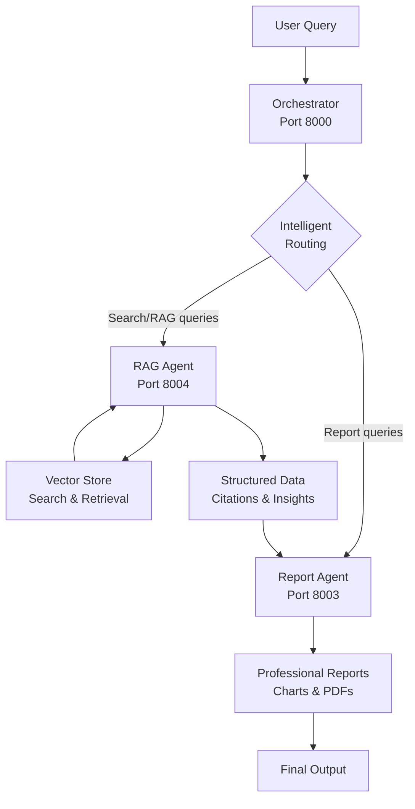

# RAG-Report Agent Integration Guide

This guide explains how to connect and use the **RAG Agent** and **Report Agent** through the **Orchestrator** for intelligent document search, retrieval, and professional report generation.

## 🏗️ Architecture Overview



## 🧩 Components

### 1. **Orchestrator** (Port 8000)
- **Purpose**: Intelligent request routing based on query analysis
- **Features**: A2A protocol, agent discovery, semantic routing
- **Routing Logic**: Analyzes query content and routes to appropriate agent

### 2. **RAG Agent** (Port 8004) 
- **Purpose**: Document search, retrieval, and knowledge extraction
- **Capabilities**:
  - Semantic document search
  - Database querying
  - Context retrieval
  - Complete RAG processing with planning and synthesis
- **MCP Tools**: `search_documents`, `query_database`, `retrieve_context`, `semantic_search`, `perform_rag_query`

### 3. **Report Agent** (Port 8003)
- **Purpose**: Professional report and document generation
- **Capabilities**:
  - Text report generation
  - Data visualization (charts, graphs)
  - PDF export with embedded visualizations
  - Statistical analysis reporting
- **Tools**: `generate_report_text`, `generate_chart`, `save_pdf`

## 🚀 Quick Start

### Prerequisites

1. **Environment Variables**:
   ```bash
   export GOOGLE_API_KEY="your-google-api-key"      # For Gemini models
   export OPENAI_API_KEY="your-openai-api-key"      # For OpenAI models and embeddings
   ```

2. **Dependencies**: Install requirements for each component
   ```bash
   # Install orchestrator dependencies
   cd orchestrator && pip install -r requirements.txt
   
   # Install RAG agent dependencies  
   cd RAG/ragAgent && pip install -r requirements.txt
   
   # Install report agent dependencies
   cd RAG/reportAgent && pip install -r requirements.txt
   ```

### Option 1: Startup Helper

Use the provided startup helper to get instructions:

```bash
./RAG/start_rag_system.sh
```

This will check your environment and provide the correct startup commands.

### Option 2: Manual Startup

Start each component in separate terminals:

```bash
# Terminal 1: Start Orchestrator
cd orchestrator
uv run -m app

# Terminal 2: Start RAG Agent  
cd RAG/ragAgent
uv run -m app

# Terminal 3: Start Report Agent
cd RAG/reportAgent  
uv run -m app
```

### Test the Integration

```bash
python3 RAG/test_system.py
```

## 🔄 Usage Workflows

### Workflow 1: Simple RAG Query

**User**: "What are the latest trends in artificial intelligence?"

**Flow**:
1. Query sent to Orchestrator
2. Orchestrator analyzes query → routes to RAG Agent
3. RAG Agent performs semantic search on vector store
4. Returns structured answer with citations

### Workflow 2: Report Generation

**User**: "Generate a professional report about AI market trends with charts"

**Flow**:
1. Query sent to Orchestrator
2. Orchestrator analyzes "report" + "charts" keywords → routes to Report Agent
3. Report Agent generates professional report with visualizations
4. Saves as PDF with embedded charts

### Workflow 3: Combined RAG-to-Report

**Step 1** - RAG Query:
```python
# Send to Orchestrator
query = "Analyze the financial performance of tech companies in 2024"
# → Routes to RAG Agent
# → Returns structured data with insights
```

**Step 2** - Report Generation:
```python
# Use RAG results for report
report_query = f"""Generate a professional report using this data:

Insights: {rag_insights}
Analysis: {rag_answer}

Include charts showing performance trends and save as PDF."""
# → Routes to Report Agent  
# → Creates comprehensive report with visualizations
```

## 🛠️ Advanced Configuration

### Vector Store Setup (RAG Agent)

The RAG Agent requires a vector store with your documents:

```python
from shared.vectorstore import VectorStore

# Initialize vector store
vs = VectorStore(path="./my_vectorstore", collection="documents")

# Ingest documents from a folder
vs.ingest_folder("./documents")  # PDF, TXT, MD files

# The RAG Agent will automatically load this store
```

### Orchestrator Routing Configuration

The orchestrator uses intelligent routing based on:

1. **Keyword Matching**: Specific terms in queries
2. **Semantic Analysis**: Understanding query intent
3. **Agent Skills**: Matching capabilities to requirements

**RAG Agent triggers**:
- Keywords: "search", "find", "what is", "analyze", "data", "information"
- Use cases: Questions, research, data retrieval

**Report Agent triggers**:
- Keywords: "report", "generate", "create", "chart", "pdf", "visualize"
- Use cases: Document creation, data visualization, formatting

### Custom Agent Skills

You can enhance routing by updating agent skills in the `__main__.py` files:

```python
# Add custom skills for better routing
AgentSkill(
    id="custom_skill",
    name="Custom capability", 
    description="Detailed description of what this does",
    tags=["keyword1", "keyword2", "keyword3"],
    examples=["Example query 1", "Example query 2"]
)
```

## 📊 API Usage Examples

### Direct A2A Protocol Calls

```python
import httpx
import asyncio

async def call_orchestrator(query: str):
    payload = {
        "jsonrpc": "2.0",
        "id": "request-1",
        "method": "message/send", 
        "params": {
            "id": "task-1",
            "message": {
                "role": "user",
                "messageId": "msg-1",
                "contextId": "ctx-1",
                "parts": [{"type": "text", "text": query}]
            },
            "configuration": {"acceptedOutputModes": ["text"]}
        }
    }
    
    async with httpx.AsyncClient() as client:
        response = await client.post(
            "http://localhost:8000",
            json=payload,
            headers={"Content-Type": "application/json"}
        )
        return response.json()

# Example queries
rag_query = "What are the key findings in our latest research?"
report_query = "Create a professional report with the data: {...}"

# Send queries
result1 = await call_orchestrator(rag_query)      # → RAG Agent
result2 = await call_orchestrator(report_query)   # → Report Agent
```

### Using MCP Tools Directly

```python
# Through RAG Agent MCP tools
from RAG.ragAgent.app.agent import search_documents, perform_rag_query

# Search documents
search_result = search_documents("artificial intelligence trends", max_results=10)

# Complete RAG query 
rag_result = perform_rag_query("What are AI market predictions?", include_citations=True)
```

## 🔧 Troubleshooting

### Common Issues

1. **"No agent found" errors**:
   - Ensure all agents are running on correct ports
   - Check orchestrator logs for agent discovery status
   - Verify network connectivity

2. **Vector store errors in RAG Agent**:
   - Run `vs.ingest_folder()` to populate vector store
   - Check OPENAI_API_KEY for embeddings
   - Verify document formats (PDF, TXT, MD)

3. **Report generation failures**:
   - Check OPENAI_API_KEY for report generation
   - Ensure matplotlib/reportlab dependencies installed
   - Verify write permissions for PDF output

4. **Routing not working correctly**:
   - Update agent skills/tags for better keyword matching
   - Check orchestrator routing logs
   - Adjust query phrasing to match agent capabilities

### Logging and Debugging

Enable detailed logging:

```bash
export LOG_LEVEL=DEBUG
python -m app  # For any component
```

Check agent discovery:
```bash
curl http://localhost:8000/agents  # List discovered agents
```

Verify individual agents:
```bash
curl http://localhost:8004/agent_card  # RAG Agent status
curl http://localhost:8003/agent_card  # Report Agent status
```

## 🎯 Best Practices

### 1. Query Design
- **For RAG queries**: Use question format, be specific about information needed
- **For reports**: Clearly state output format (PDF, charts, etc.)

### 2. Data Flow
- Use RAG Agent first to gather and analyze data
- Pass structured results to Report Agent for visualization
- Chain queries through orchestrator for automatic routing

### 3. Performance
- Keep vector store updated with latest documents
- Use appropriate chunk sizes for document ingestion  
- Monitor agent response times and optimize accordingly

### 4. Integration Patterns
- **Research → Report**: RAG query followed by report generation
- **Search → Visualize**: Document search with chart creation
- **Analyze → Summarize**: Data analysis with executive summary

## 📝 Example Use Cases

1. **Market Research Report**:
   - Query: "Research current AI market trends"
   - Result: RAG Agent searches documents → Report Agent creates market analysis PDF

2. **Technical Documentation**:
   - Query: "Generate API documentation report with usage statistics"  
   - Result: Combined search and professional formatting

3. **Data Analysis Workflow**:
   - Query: "Analyze quarterly sales data and create executive summary"
   - Result: Data retrieval + visualization + formatted report

4. **Research Paper Assistant**:
   - Query: "Find papers on machine learning, create literature review"
   - Result: Semantic search + citation formatting + structured document

---

🚀 **Ready to get started?** Run `python RAG/start_rag_report_system.py` and begin exploring the powerful RAG-Report integration!
