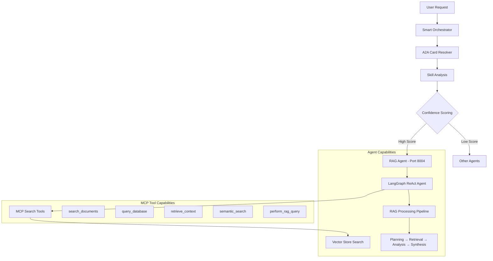

# RAG Agent - Retrieval-Augmented Generation with MCP Tools

A sophisticated RAG (Retrieval-Augmented Generation) agent built with [LangGraph](https://langchain-ai.github.io/langgraph/) and exposed through the A2A protocol. It provides intelligent document retrieval, semantic search, and comprehensive answer generation with MCP (Model Context Protocol) tool capabilities for external integration. **The agent integrates seamlessly with the [intelligent orchestrator system](../../orchestrator/README.md) for automatic routing**.

##  **Smart Orchestrator Integration**

The RAG Agent integrates with the intelligent orchestrator for automatic routing:

### Direct RAG Operations
```
"Search for documents about AI" → RAG Agent (100% confidence)
"What is the weather in Tokyo?" → RAG Agent (95% confidence)
"Query database for user information" → RAG Agent (90% confidence)
```

### Skill-Based Routing
```
"document search and retrieval" → RAG Agent (100% confidence)
"semantic search capabilities" → RAG Agent (100% confidence)
"complete RAG processing" → RAG Agent (95% confidence)
```

##  System Integration

This agent integrates seamlessly with the orchestrator system:



##  Key Features

###  **MCP Tool Capabilities**
- **search_documents**: Search through documents using semantic search
- **query_database**: Execute database queries to retrieve structured data
- **retrieve_context**: Get relevant context and background information
- **semantic_search**: Perform advanced semantic search across indexed content  
- **perform_rag_query**: Complete RAG processing with planning, retrieval, analysis, and synthesis

###  **RAG Processing Pipeline**
- **Planning**: Breaks down complex queries into precise retrieval subtasks
- **Retrieval**: Semantic search across vector database with multiple strategies
- **Analysis**: Extracts key facts with citations from retrieved documents
- **Synthesis**: Generates comprehensive answers with proper citations
- **Context Management**: Intelligent context window tracking and summarization

###  **Advanced AI Capabilities**  
- **Multi-turn Conversations**: Agent maintains context across interactions
- **Real-time Streaming**: Provides status updates during processing
- **Conversational Memory**: Context tracking with automatic summarization
- **A2A Protocol**: Standardized communication interface

###  **Orchestrator Integration**
- **Automatic Routing**: Intelligent routing based on request content
- **Skill Discovery**: Capabilities automatically discovered by orchestrator
- **Confidence Scoring**: High-confidence routing for search and retrieval operations
- **Dynamic Registration**: Can be registered/unregistered at runtime

##  Supported Operations

### Document Search & Retrieval
- **Semantic Search**: "Search for documents about machine learning"
- **Document Discovery**: "Find information on climate change"
- **Content Retrieval**: "Retrieve documents containing financial data"

### Database Querying
- **Structured Queries**: "Query database for user information"
- **Analytics**: "Get analytics data from last month"
- **Data Retrieval**: "Retrieve structured data about products"

### Context & Background
- **Research**: "Get context about blockchain technology"
- **Background Info**: "Retrieve background on company history"
- **Related Information**: "Find related information about renewable energy"

### Complete RAG Processing
- **Comprehensive Analysis**: "Comprehensive analysis of market trends"
- **Research Reports**: "Complete research on technology adoption"
- **Cited Responses**: "Full analysis with citations and sources"

##  Agent Card (A2A Integration)

### Orchestrator Recognition

The orchestrator recognizes this agent with the following capabilities:

```python
RAG Agent Card:
- agent_id: "rag"
- name: "RAG Agent"
- description: "Handles RAG search operations with MCP tool capabilities"
- endpoint: "http://localhost:8004"
- skills: [
    "rag_search",           # Core RAG operations
    "document_search",      # Document search and retrieval
    "database_query",       # Database querying via MCP
    "context_retrieval",    # Context and background retrieval
    "semantic_search",      # Advanced semantic search
    "complete_rag"         # Full RAG processing pipeline
  ]
- keywords: ["rag", "search", "documents", "semantic", "retrieval", 
            "database", "query", "context", "background", "mcp"]
```

### Routing Examples

```bash
# High-confidence RAG routing (90%+)
"Search for documents about AI" → RAG Agent (100%)
"What is the weather in Tokyo?" → RAG Agent (95%)
"Query database for analytics" → RAG Agent (90%)
"Get context about machine learning" → RAG Agent (95%)

# Skill-based routing
"document search and retrieval" → RAG Agent (100%)
"semantic search capabilities" → RAG Agent (100%)
"complete RAG processing" → RAG Agent (95%)
"database querying" → RAG Agent (88%)
```

##  Quick Start

### Option 1: Via Orchestrator (Recommended)

Run as part of the intelligent orchestration system:

```bash
# Terminal 1: Start RAG Agent
cd RAG/ragAgent
uv sync
uv run -m app

# Terminal 2: Start Orchestrator
cd ../../orchestrator
uv run -m app

# Terminal 3: Test routing
cd ../orchestrator
# Direct RAG operations
uv run -m app -m "Search for documents about artificial intelligence" -v
uv run -m app -m "What is the weather in Tokyo?" -v
uv run -m app -m "Query database for user analytics" -v

# Using client
cd ../orchestrator_client
uv run . --agent http://localhost:8000
# > "Search for information about climate change"
```

### Option 2: Direct Agent Connection

Connect directly to the RAG agent:

```bash
cd RAG/ragAgent

# Create environment file with your API keys
echo "OPENAI_API_KEY=your_openai_api_key_here" > .env

# OR for alternative OpenAI-compatible LLM providers
echo "OPENAI_API_KEY=your_api_key_here" > .env
echo "TOOL_LLM_URL=your_llm_url" > .env
echo "TOOL_LLM_NAME=your_llm_name" > .env

# Run the agent
uv run -m app

# Test MCP tools directly
curl -X POST http://localhost:8004 \
  -H "Content-Type: application/json" \
  -d '{"method": "tools/call", "params": {"name": "search_documents", "arguments": {"query": "artificial intelligence", "max_results": 5}}}'
```

##  Testing & Validation

### Comprehensive Test Suite

```bash
# Run agent-specific tests
cd RAG/ragAgent
uv run -m app

# Test orchestrator routing
cd ../../orchestrator
uv run -m app -m "Search for documents about machine learning" -v
uv run -m app -m "Query database for user information" -v

# Test MCP tools directly
curl -X POST http://localhost:8004 \
  -H "Content-Type: application/json" \
  -d '{"method": "tools/call", "params": {"name": "perform_rag_query", "arguments": {"question": "What is artificial intelligence?"}}}'
```

### Expected Test Results

**RAG Operations**:
```
 Document Search: "Found 5 relevant documents about artificial intelligence"
 Semantic Search: "Retrieved semantically similar content with 0.95 similarity"
 Context Retrieval: "Background information collected from 3 sources"
 Complete RAG: "Comprehensive answer generated with citations [1][2][3]"
```

**MCP Tool Operations**:
```
 search_documents: "JSON response with document results and metadata"
 query_database: "Structured data retrieved and formatted as JSON"
 retrieve_context: "Contextual information with sources and related topics"
 semantic_search: "Advanced semantic search results with similarity scores"
 perform_rag_query: "Complete RAG response with plan, insights, and citations"
```

##  Technical Architecture

### LangGraph Integration

The agent uses LangGraph ReAct pattern for intelligent RAG operations:

```python
from langgraph.prebuilt import create_react_agent
from langchain_core.tools import tool

@tool
def search_documents(query: str, max_results: int = 5) -> str:
    """Search through documents using semantic search"""
    # Vector store integration
    
@tool
def perform_rag_query(question: str, include_citations: bool = True) -> str:
    """Complete RAG processing pipeline"""
    # Planning → Retrieval → Analysis → Synthesis
    
class RAGAgent:
    def __init__(self, vector_store: VectorStore):
        from langchain_openai import ChatOpenAI
        self.model = ChatOpenAI(model='gpt-4o-mini')
        self.tools = [search_documents, query_database, semantic_search, perform_rag_query]
        self.graph = create_react_agent(self.model, tools=self.tools)
```

### A2A Protocol Implementation

```python
from a2a.server.agent_execution import AgentExecutor

class RAGAgentExecutor(AgentExecutor):
    def __init__(self):
        self.agent = RAGAgent(vector_store)
    
    async def execute(self, context: RequestContext, event_queue: EventQueue):
        # Handle A2A protocol requests
        # Route to LangGraph agent with MCP tools
        # Return formatted responses with citations and metadata
```

### MCP Tool Architecture

The agent exposes MCP tools for external integration:

```python
# Tools use agent instance references for access to vector store
search_documents._agent_instance = self
query_database._agent_instance = self
retrieve_context._agent_instance = self
semantic_search._agent_instance = self
perform_rag_query._agent_instance = self
```

### RAG Processing Pipeline

The agent uses a sophisticated multi-stage pipeline:

1. **Planning Stage**: Breaks down queries into 2-4 precise retrieval subtasks
2. **Retrieval Stage**: Semantic search with k=4 documents per subtask
3. **Analysis Stage**: Extracts key facts with citations using JSON format
4. **Synthesis Stage**: Generates final answer with inline citations
5. **Context Management**: Automatic summarization every 4 turns to maintain context

##  Development

### Project Structure
```
RAG/ragAgent/
├── app/
│   ├── __init__.py
│   ├── __main__.py           # A2A server entry point
│   ├── agent_executor.py     # A2A protocol executor
│   └── agent.py              # RAG agent with MCP tools
├── pyproject.toml           # Dependencies and metadata
└── README.md               # This file
```

### Dependencies
```toml
dependencies = [
    "a2a-sdk[http-server]>=0.3.0",     # A2A protocol and MCP support
    "langchain-openai>=0.1.0",         # OpenAI integration  
    "langgraph>=0.2.0",                # ReAct agent framework
    "chromadb>=0.5.5",                 # Vector database
    "tiktoken>=0.7.0",                 # Token counting
    "pypdf>=4.2.0",                    # PDF document processing
    "pydantic>=2.0.0",                 # Data validation
]
```

### Environment Configuration
```bash
# OpenAI (required)
export OPENAI_API_KEY="your-openai-api-key"

# Optional: For custom OpenAI-compatible endpoints
export TOOL_LLM_URL="https://your-custom-endpoint.com/v1"
export TOOL_LLM_NAME="gpt-4o-mini"
```

##  Configuration Options

### Vector Store Configuration
```python
# Vector store integration with shared module
from shared.vectorstore import VectorStore
from shared.context import ContextWindowTracker

vector_store = VectorStore()  # ChromaDB backend
agent = RAGAgent(vector_store)
```

### Context Window Management
```python
# Automatic context tracking and summarization
self.tracker_plan = ContextWindowTracker(model_name)
self.tracker_an = ContextWindowTracker(model_name)
self.tracker_sum = ContextWindowTracker(model_name)

# Summarize every 4 turns to maintain context
self.turns_since_summary = 0
if self.turns_since_summary >= 4:
    self.tracker_plan.update_summary(self._simple_summarizer)
```

### Tool Configuration
```python
# MCP tools with agent instance references
tools = [search_documents, query_database, retrieve_context, semantic_search, perform_rag_query]

# Each tool gets access to the agent instance
for tool in tools:
    tool._agent_instance = self
```

##  API Reference

### RAGAgent Class
```python
class RAGAgent:
    def __init__(self, vector_store: VectorStore)
    def invoke(self, query: str, context_id: str) -> dict
    async def stream(self, query: str, context_id: str) -> AsyncIterable[dict]
    def get_agent_response(self, config: dict) -> dict
    def _perform_rag_search(self, user_query: str) -> dict
```

### MCP Tools
```python
search_documents(query: str, max_results: int = 5) -> str
query_database(sql_query: str, database: str = "vector_db") -> str
retrieve_context(topic: str, document_types: str = "all") -> str
semantic_search(query: str, index_name: str = "default", filters: str = "{}") -> str
perform_rag_query(question: str, include_citations: bool = True) -> str
```

### Response Formats
All MCP tools return JSON strings with structured data including:
- Query/question information
- Results with content and metadata
- Citations and sources
- Error handling and fallback information

---

**Built with LangGraph, A2A Protocol, ChromaDB, and MCP Tools** 
