# Report Agent - Professional Document Generation with Data Visualization

A sophisticated report generation agent built with [LangGraph](https://langchain-ai.github.io/langgraph/) and exposed through the A2A protocol. It generates professional reports and PDF documents from data insights and markdown content, with advanced data visualization capabilities including charts and graphs. The agent supports multi-turn dialogue and streaming responses. **The agent integrates seamlessly with the [intelligent orchestrator system](../../orchestrator/README.md) for automatic routing**.

## 🚀 **Smart Orchestrator Integration**

The Report Agent integrates with the intelligent orchestrator for automatic routing:

### Direct Report Operations
```
"Generate a report from this data" → Report Agent (100% confidence)
"Create a professional PDF document" → Report Agent (95% confidence)
"Create charts from this data" → Report Agent (98% confidence)
```

### Skill-Based Routing
```
"professional report generation" → Report Agent (100% confidence)
"data visualization and charting" → Report Agent (100% confidence)
"data analysis reporting" → Report Agent (89% confidence)
```

## 🏗️ System Integration

This agent integrates seamlessly with the orchestrator system:

```mermaid
graph TD
    A[User Request] --> B[🤖 Smart Orchestrator]
    B --> C[A2A Card Resolver]
    C --> D[Skill Analysis]
    D --> E{Confidence Scoring}
    E -->|High Score| F[📊 Report Agent - Port 8003]
    E -->|Low Score| G[Other Agents]
    
    F --> H[LangGraph ReAct Agent]
    H --> I[Report Generation Tool]
    I --> J[OpenAI GPT-4o-mini]
    H --> K[Chart Generation Tool]
    K --> L[Matplotlib/Pandas Engine]
    H --> M[PDF Generation Tool]
    M --> N[ReportLab PDF Engine with Charts]
    
    subgraph "Agent Capabilities"
        F
        H
        I
        J
        K
        L
    end
```



## ✨ Key Features

### 📄 Report Generation Operations
- **Professional Reports**: Structured documents with title, executive summary, findings, and recommendations
- **PDF Export**: High-quality PDF generation with proper formatting and embedded charts
- **Data Processing**: Handles JSON insights and markdown content with context window management
- **Citation Support**: Inline citations and references
- **Large Dataset Handling**: Automatic truncation and optimization for datasets exceeding context limits

### 📊 Data Visualization Operations
- **Chart Generation**: Create bar, line, pie, scatter, and histogram charts
- **Data Analysis**: Visual analysis of trends, patterns, and statistical data
- **Automatic Integration**: Charts are automatically embedded in PDF reports
- **Multiple Formats**: Support for various data input formats (JSON, lists, dictionaries)

### 🤖 Advanced AI Capabilities  
- **Multi-turn Conversations**: Agent can request additional information when needed
- **Real-time Streaming**: Provides status updates during processing
- **Conversational Memory**: Maintains context across interactions
- **A2A Protocol**: Standardized communication interface

### 🔗 Orchestrator Integration
- **Automatic Routing**: Intelligent routing based on request content
- **Skill Discovery**: Capabilities automatically discovered by orchestrator
- **Confidence Scoring**: High-confidence routing for report operations
- **Dynamic Registration**: Can be registered/unregistered at runtime

## 🎯 Supported Operations

### Report Generation
- **Data Reports**: "Generate a report from this JSON data"
- **Analysis Reports**: "Create an analysis report with these insights"
- **Professional Documents**: "Make a professional document from this content"
- **PDF Export**: "Save this report as a PDF"

### Data Visualization
- **Chart Creation**: "Create a bar chart from this sales data"
- **Trend Analysis**: "Generate a line chart showing performance over time"
- **Distribution Analysis**: "Make a pie chart of market share data"
- **Statistical Plots**: "Create a scatter plot of correlation data"
- **Histogram Analysis**: "Generate a histogram of this dataset"

### Document Formatting
- **Structure Creation**: "Format this data into a professional report with charts"
- **Executive Summaries**: "Create an executive summary of these findings"
- **Recommendation Reports**: "Generate recommendations based on this analysis with supporting visuals"

## 📊 Agent Card (A2A Integration)

### Orchestrator Recognition

The orchestrator recognizes this agent with the following capabilities:

```python
Report Agent Card:
- agent_id: "report"
- name: "Report Agent"
- description: "Generates professional reports and documents with data visualization and charting capabilities"
- endpoint: "http://localhost:8003"
- skills: [
    "report_generation",         # Primary report operations
    "data_visualization",        # Chart and graph generation
    "data_analysis_reporting",   # Data analysis and reporting
    "document_formatting",       # Document structure and formatting
    "executive_summary",         # Executive summary creation
    "pdf_generation",           # PDF document generation with charts
    "statistical_analysis"      # Statistical analysis and visualization
  ]
- keywords: ["report", "document", "pdf", "analysis", "summary", 
            "insights", "findings", "recommendations", "professional",
            "chart", "graph", "visualization", "bar", "line", "pie", "scatter"]
```

### Routing Examples

```bash
# High-confidence Report routing (90%+)
"Generate a report from this data" → Report Agent (100%)
"Create a professional PDF document" → Report Agent (95%)
"Make an executive summary" → Report Agent (90%)
"Create charts from this data" → Report Agent (98%)
"Generate a bar chart" → Report Agent (95%)

# Skill-based routing
"professional report generation" → Report Agent (100%)
"data visualization and charting" → Report Agent (100%)
"data analysis reporting" → Report Agent (89%)
"statistical analysis" → Report Agent (85%)
"document formatting" → Report Agent (82%)
```

## 🚀 Quick Start

### Option 1: Via Orchestrator (Recommended)

Run as part of the intelligent orchestration system:

```bash
# Terminal 1: Start Report Agent
cd RAG/reportAgent
uv sync
uv run -m app

# Terminal 2: Start Orchestrator
cd ../../orchestrator
uv run -m app

# Terminal 3: Test routing
cd ../orchestrator
# Direct report operations
uv run -m app -m "Generate a report from this data: {insights: 'high performance', recommendations: 'optimize further'}" -v
uv run -m app -m "Create a professional PDF document" -v
uv run -m app -m "Create a bar chart from this sales data: {'Q1': 100, 'Q2': 150, 'Q3': 200, 'Q4': 175}" -v

# Using client
cd ../orchestrator_client
uv run . --agent http://localhost:8000
# > "Generate a report with executive summary and charts"
```

### Option 2: Direct Agent Connection

Connect directly to the report agent:

```bash
cd RAG/reportAgent

# Create environment file with your API keys
echo "OPENAI_API_KEY=your_openai_api_key_here" > .env

# OR for alternative OpenAI-compatible LLM providers
echo "OPENAI_API_KEY=your_api_key_here" > .env
echo "TOOL_LLM_URL=https://your-custom-endpoint.com/v1" > .env
echo "TOOL_LLM_NAME=gpt-4o-mini" > .env

# Run the agent
uv run -m app

# Test directly using curl
curl -X POST http://localhost:8005 \
  -H "Content-Type: application/json" \
  -d '{"method": "message/send", "params": {"message": {"parts": [{"text": "Generate a report from insights: {performance: high} and answer: Great results achieved"}]}}}'
```

## 🧪 Testing & Validation

### Comprehensive Test Suite

```bash
# Run agent-specific tests
cd RAG/reportAgent
uv run -m app

# Test orchestrator routing
cd ../../orchestrator
uv run -m app -m "Generate a professional report" -v
uv run -m app -m "Create an executive summary document" -v

# Test direct agent communication
curl -X POST http://localhost:8005 \
  -H "Content-Type: application/json" \
  -d '{"method": "message/send", "params": {"message": {"parts": [{"text": "Generate a report from this data"}]}}}'
```

### Expected Test Results

**Report Operations**:
```
✅ Generate Report: "Professional report created with executive summary and recommendations"
✅ PDF Export: "Report saved as rag_report.pdf successfully with embedded charts"
✅ Data Processing: "Analyzed JSON insights and markdown content into structured report"
✅ Executive Summary: "Executive summary created with key findings highlighted"
```

**Chart Generation Operations**:
```
✅ Bar Chart: "Bar chart created and saved as chart_bar_20241215_143022.png"
✅ Line Chart: "Line chart showing trends created successfully"
✅ Pie Chart: "Pie chart with percentages generated from data"
✅ Scatter Plot: "Scatter plot showing correlations created"
✅ Histogram: "Histogram analysis of data distribution completed"
```

**Context Window Management**:
```
✅ Large Dataset: "Content optimized for context window (truncated 15% of data)"
✅ Token Counting: "Processed 45,231 tokens within 120K limit"
✅ Automatic Retry: "Context exceeded, retrying with reduced content"
✅ Graceful Handling: "Report generated successfully despite large input size"
```

## 🔧 Technical Architecture

### LangGraph Integration

The agent uses LangGraph ReAct pattern for intelligent report generation:

```python
from langgraph.prebuilt import create_react_agent
from langchain_core.tools import tool

@tool
def generate_report_text(insights_json: str, answer_markdown: str) -> str:
    """Generate professional report from insights and answers"""
    # OpenAI integration for report generation
    
@tool
def generate_chart(data_json: str, chart_type: str, title: str) -> str:
    """Generate charts and graphs for data visualization"""
    # Matplotlib/Pandas integration for chart generation
    
@tool
def save_pdf(text: str, path: str = "rag_report.pdf", chart_paths: str = "") -> str:
    """Save report as PDF using ReportLab with embedded charts"""
    # PDF generation with proper formatting and chart integration
    
class ReportAgent:
    def __init__(self):
        from langchain_openai import ChatOpenAI
        self.model = ChatOpenAI(model='gpt-4o-mini')
        self.tools = [generate_report_text, generate_chart, save_pdf]
        self.graph = create_react_agent(self.model, tools=self.tools)
```

### A2A Protocol Implementation

```python
from a2a.server.agent_execution import AgentExecutor

class ReportAgentExecutor(AgentExecutor):
    def __init__(self):
        self.agent = ReportAgent()
    
    async def execute(self, context: RequestContext, event_queue: EventQueue):
        # Handle A2A protocol requests
        # Route to LangGraph agent
        # Return formatted responses with artifacts
```

### Report Generation Pipeline

The agent uses a sophisticated pipeline for report creation:

- **Input Processing**: Handles JSON insights and markdown content with intelligent truncation
- **Context Window Management**: Uses tiktoken for accurate token counting and automatic content optimization
- **AI Generation**: Uses OpenAI GPT-4o-mini (128K context) for professional writing
- **Structure**: Creates title, executive summary, key findings, recommendations, references
- **PDF Export**: Uses ReportLab for high-quality PDF generation with proper formatting

### Context Window Management

The agent intelligently handles large datasets:

```python
# Automatic token counting and truncation
MAX_CONTEXT_TOKENS = 120000  # GPT-4o-mini limit with buffer
- Counts tokens using tiktoken for accuracy
- Proportionally truncates insights and content
- Preserves data integrity with clear truncation notices
- Automatic retry with reduced content on context errors
```

## 🛠️ Development

### Project Structure
```
RAG/reportAgent/
├── app/
│   ├── __init__.py
│   ├── __main__.py           # A2A server entry point
│   ├── agent_executor.py     # A2A protocol executor
│   └── agent.py              # Report agent logic
├── pyproject.toml           # Dependencies and metadata
└── README.md               # This file
```

### Dependencies
```toml
dependencies = [
    "a2a-sdk>=0.3.0",                   # A2A protocol support
    "langchain-google-genai>=2.0.10",   # Google AI integration
    "langchain-openai>=0.1.0",          # OpenAI integration  
    "langgraph>=0.3.18",                # ReAct agent framework
    "reportlab>=4.0.0",                 # PDF generation
    "openai>=1.0.0",                    # Report text generation
    "tiktoken>=0.5.0",                  # Token counting for context management
    "matplotlib>=3.7.0",                # Chart and graph generation
    "pandas>=2.0.0",                    # Data processing and analysis
    "pydantic>=2.10.6",                 # Data validation
]
```

### Environment Configuration
```bash
# OpenAI (required for agent orchestration and report generation)
export OPENAI_API_KEY="your-openai-api-key"

# OR Alternative OpenAI-compatible LLM provider
export OPENAI_API_KEY="your-api-key"
export TOOL_LLM_URL="https://your-custom-endpoint.com/v1"
export TOOL_LLM_NAME="gpt-4o-mini"
```

## 🔧 Configuration Options

### LLM Configuration
```python
# Uses OpenAI by default
self.model = ChatOpenAI(
    model=os.getenv("TOOL_LLM_NAME", "gpt-4o-mini"),
    openai_api_key=os.getenv("OPENAI_API_KEY", os.getenv("API_KEY", "")),
    openai_api_base=os.getenv("TOOL_LLM_URL", None),
    temperature=0
)
```

### Response Format Configuration
```python
class ResponseFormat(BaseModel):
    status: Literal['input_required', 'completed', 'error'] = 'input_required'
    message: str
```

### Tool Configuration
```python
@tool
def generate_report_text(insights_json: str, answer_markdown: str) -> str:
    """
    Generate professional reports with:
    - Title and executive summary
    - Key findings with citations
    - Recommendations and references
    """

@tool
def save_pdf(text: str, path: str = "rag_report.pdf") -> str:
    """
    Save reports as PDF with:
    - Professional formatting
    - Proper spacing and layout
    - ReportLab styling
    """
```

## 📚 API Reference

### ReportAgent Class
```python
class ReportAgent:
    def invoke(self, query: str, context_id: str) -> str
    async def stream(self, query: str, context_id: str) -> AsyncIterable[dict]
    def get_agent_response(self, config: dict) -> dict
```

### Report Generation Tools
```python
generate_report_text(insights_json: str, answer_markdown: str) -> str
generate_chart(data_json: str, chart_type: str, title: str, x_label: str, y_label: str) -> str
save_pdf(text: str, path: str = "rag_report.pdf", chart_paths: str = "") -> str
```

### Supported Chart Types
```python
chart_types = ["bar", "line", "pie", "scatter", "histogram"]
```

---

**Built with LangGraph, A2A Protocol, OpenAI, ReportLab, Matplotlib, and Pandas** 📊
