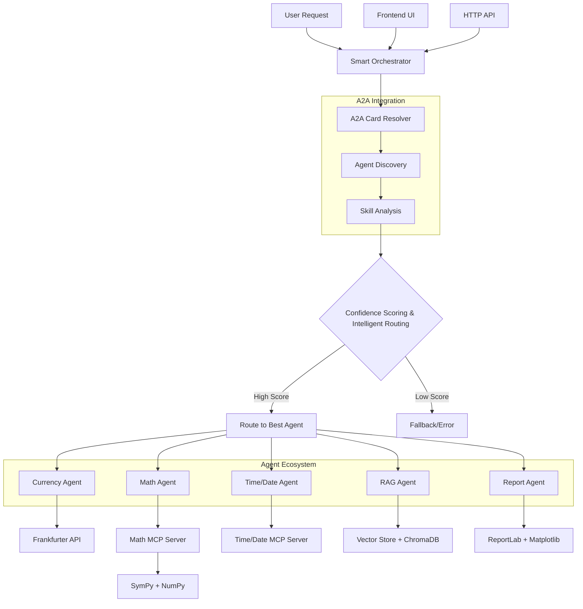

# Multi-Agent Orchestration System

An advanced multi-agent system built with **LangGraph** and **A2A Protocol** that features intelligent request routing, specialized agents for different domains, and dynamic capability discovery.

## Blog

- [Building an Intelligent Multi-Agent Orchestration System with LangGraph, A2A and MCP](https://medium.com/@gyliu513/building-an-intelligent-multi-agent-orchestration-system-with-langgraph-a2a-and-mcp-674efdf666f7)

## Overview

This project demonstrates a production-ready agent orchestration system where:
- **Smart Orchestrator** intelligently routes requests to the best available agent using skill-based matching
- **Currency Agent** manages financial data and currency conversions
- **Math Agent** performs advanced mathematical calculations and analysis
- **Time/Date Agent** handles timezone conversions and date calculations
- **RAG Agent** provides document search and retrieval with semantic search
- **Report Agent** generates professional reports and data visualizations
- **Frontend UI** provides a modern web interface for interacting with the system
- **A2A Protocol** enables standardized agent communication with dynamic discovery

## **Key Features**

### Intelligent Agent Routing
- **Dynamic Agent Discovery**: Automatically discovers agent capabilities from AgentCards
- **Skill-Based Matching**: Routes requests based on agent skills, tags, and descriptions
- **Confidence Scoring**: Provides confidence scores for routing decisions
- **Real-time Registration**: Agents can be registered/unregistered dynamically

### A2A Protocol Integration  
- **Standardized Communication**: Uses A2A SDK for consistent agent interactions
- **AgentCard Management**: Automatic capability discovery from agent metadata
- **HTTP Client Integration**: Built-in HTTP client with timeout and error handling
- **Live Agent Discovery**: Fetches agent cards from running agent endpoints

## System Architecture



## Agent Capabilities

### **Math Agent** (Port 8002)
- **Skills**: `arithmetic_calculation`, `equation_solving`, `calculus_operations`, `matrix_operations`
- **Use Cases**: "What is 2+3?", "Solve x^2-4=0", "Find derivative of x^2"
- **Integration**: Custom MCP server with SymPy and NumPy
- **Documentation**: [Math Agent README](./mathAgent/README.md)

### **Currency Agent** (Port 8003)  
- **Skills**: `currency_exchange`, `financial_data`, `market_analysis`, `rate_conversion`
- **Use Cases**: "What is 10 USD to INR?", "What's the exchange rate?", "Historical rates"
- **Integration**: Frankfurter API with LangGraph ReAct agent
- **Documentation**: [Currency Agent README](./currencyAgent/README.md)

### **Time/Date Agent** (Port 8001)
- **Skills**: `current_time`, `timezone_conversion`, `date_calculation`, `date_formatting`
- **Use Cases**: "What time is it in New York?", "Convert EST to PST", "How many days until Christmas?"
- **Integration**: Custom MCP server with Python datetime and timezone libraries
- **Documentation**: [Time/Date Agent README](./timeDateAgent/README.md)

### **RAG Agent** (Port 8004)
- **Skills**: `rag_search`, `document_search`, `database_query`, `semantic_search`, `complete_rag`
- **Use Cases**: "Search for documents about AI", "Query database for analytics", "Get context about machine learning"
- **Integration**: ChromaDB vector store with semantic search capabilities
- **Documentation**: [RAG Agent README](./RAG/ragAgent/README.md)

### **Report Agent** (Port 8005)
- **Skills**: `report_generation`, `data_visualization`, `pdf_generation`, `statistical_analysis`
- **Use Cases**: "Generate a report from this data", "Create a bar chart", "Make a professional PDF document"
- **Integration**: ReportLab for PDF generation, Matplotlib for charts
- **Documentation**: [Report Agent README](./RAG/reportAgent/README.md)

##  Quick Start

### Prerequisites
- **Python 3.11+** (required for A2A SDK compatibility)
- **[uv](https://docs.astral.sh/uv/)** package manager
- **API Keys** (Google Gemini or OpenAI; for Google Gemini, ensure Gemini API is enabled under your Google Cloud project)

### 1. Install Dependencies
```bash
# Clone the repository
git clone <repository-url>
cd multi-agent-orchestration

# Install orchestrator (required)
cd orchestrator && uv sync && cd ..

# Install agents (install as needed)
cd currencyAgent && uv sync && cd ..
cd mathAgent && uv sync && cd ..
cd timeDateAgent && uv sync && cd ..
cd RAG/ragAgent && uv sync && cd ../..
cd RAG/reportAgent && uv sync && cd ../..

# Optional: Install frontend
cd frontend && npm install && cd ..
```

### 2. Set Environment Variables
```bash
# Required for LLM (choose one)
# Option 1: Google Gemini
export GOOGLE_API_KEY="your-google-api-key"

# Option 2: OpenAI
export OPENAI_API_KEY="your-openai-api-key"
# OR
export API_KEY="your-openai-api-key"
export TOOL_LLM_URL="https://api.openai.com/v1"
export TOOL_LLM_NAME="gpt-4o-mini"
```

### 3. Test the Smart Orchestrator

```bash
cd orchestrator

# Test intelligent routing
uv run -m app -m "what is 10 USD to INR?" -v
uv run -m app -m "What is 2+3?" -v
uv run -m app -m "What time is it in New York?" -v

# View agent discovery
uv run -m app -m "LIST_AGENTS"
```

##  Running the Complete System

### Option A: Full Multi-Agent System

**Attention**: Run agents first, then start the Orchestrator so that agents can be detected. The orchestrator will automatically discover and register running agents.

**Terminal 1: Math Agent** (Port 8002)
```bash
cd mathAgent
export GOOGLE_API_KEY=your_google_api_key
# OR export OPENAI_API_KEY=your_openai_api_key
uv run -m app --host localhost --port 8002
```

**Terminal 2: Currency Agent** (Port 8003)
```bash
cd currencyAgent
export GOOGLE_API_KEY=your_google_api_key
# OR export OPENAI_API_KEY=your_openai_api_key
uv run -m app --host localhost --port 8003
```

**Terminal 3: Time/Date Agent** (Port 8001)
```bash
cd timeDateAgent
export OPENAI_API_KEY=your_openai_api_key
uv run -m app --host localhost --port 8001
```

**Terminal 4: RAG Agent** (Port 8004) - Optional
```bash
cd RAG/ragAgent
export OPENAI_API_KEY=your_openai_api_key
uv run -m app --host localhost --port 8004
```

**Terminal 5: Report Agent** (Port 8005) - Optional
```bash
cd RAG/reportAgent
export OPENAI_API_KEY=your_openai_api_key
uv run -m app --host localhost --port 8005
```

**Terminal 6: Smart Orchestrator** (Port 8000)
```bash
cd orchestrator
export GOOGLE_API_KEY=your_google_api_key
# OR export OPENAI_API_KEY=your_openai_api_key
uv run -m app --host localhost --port 8000
```

**Terminal 7: Frontend UI** (Port 3000) - Optional
```bash
cd frontend
npm run dev
# Open http://localhost:3000 in your browser
```

**Try these routing examples:**
```bash
# Via orchestrator CLI
cd orchestrator
uv run -m app -m "what is 10 USD to INR" -v      # → Currency Agent (100% confidence)
uv run -m app -m "What is 2+3?" -v                # → Math Agent (95% confidence)
uv run -m app -m "What time is it in New York?" -v # → Time/Date Agent (100% confidence)
uv run -m app -m "Search for documents about AI" -v # → RAG Agent (100% confidence)

# Via Frontend UI
# Navigate to http://localhost:3000 and use the web interface
```

### Option B: Orchestrator Only (Testing Mode)

Perfect for testing routing logic without running actual agents:

```bash
cd orchestrator

# Test intelligent routing
uv run -m app -m "What's the USD to EUR exchange rate?" -v
uv run -m app -m "What is 2+3?" -v
uv run -m app -m "What time is it in Tokyo?" -v

# Register agents dynamically
uv run -m app -m "REGISTER_AGENT:http://localhost:8002"  # Math Agent
uv run -m app -m "REGISTER_AGENT:http://localhost:8003"  # Currency Agent
uv run -m app -m "LIST_AGENTS"
```

##  Agent Management

### Agent Register

Register agents using the orchestrator's management API or CLI:

```bash
# Via CLI
cd orchestrator
uv run -m app -m "REGISTER_AGENT:http://localhost:8002"

# Via HTTP API
curl -X POST http://localhost:8000/management/api/v1/agents/register \
     -H 'Content-Type: application/json' \
     -d '{"endpoint": "http://localhost:8002"}'  # Math Agent
```

### Agent Unregister

Unregister agents when they're no longer needed:

```bash
# Via CLI
cd orchestrator
uv run -m app -m "UNREGISTER_AGENT:Currency Agent"

# Via HTTP API
curl -X POST http://localhost:8000/management/api/v1/agents/unregister \
     -H 'Content-Type: application/json' \
     -d '{"agent_identifier": "Currency Agent"}'
```

### Agent List

List all registered agents:

```bash
# Via CLI
cd orchestrator
uv run -m app -m "LIST_AGENTS"

# Via HTTP API
curl http://localhost:8000/management/api/v1/agents/list
```

**Example Output:**
```
============================================================
 AVAILABLE AGENTS
============================================================
Found 5 available agents:

1. Math Agent (http://localhost:8002)
   Description: Advanced mathematical assistant for calculations, equation solving, calculus, statistics, and matrix operations via MCP
   Skills: Arithmetic Calculation, Equation Solving, Calculus Operations

2. Currency Agent (http://localhost:8003)
   Description: Handles currency exchange and financial data
   Skills: Currency exchange operations, Financial data analysis, Market analysis and trends

3. Time/Date Agent (http://localhost:8001)
   Description: Handles time and date operations with timezone support
   Skills: Current Time, Timezone Conversion, Date Calculation

4. RAG Agent (http://localhost:8004)
   Description: Handles RAG search operations with MCP tool capabilities
   Skills: Document Search, Semantic Search, Database Query

5. Report Agent (http://localhost:8005)
   Description: Generates professional reports and documents with data visualization
   Skills: Report Generation, Data Visualization, PDF Generation

============================================================
 The orchestrator will automatically route your requests to the best agent!
============================================================
```

For more details, see the [Orchestrator README](./orchestrator/README.md) which includes comprehensive API documentation.

## Development

### Project Structure
```
multi-agent-orchestration/
├── orchestrator/          # Smart orchestrator with A2A integration
├── currencyAgent/         # Financial data & currency conversion
├── mathAgent/             # Mathematical calculations & analysis
├── timeDateAgent/         # Timezone & date operations
├── RAG/
│   ├── ragAgent/          # Document search & retrieval
│   ├── reportAgent/       # Report generation & visualization
│   └── shared/           # Shared RAG utilities
├── agentTemplate/         # Template for creating new agents
├── frontend/              # React web UI
└── README.md              # This file
```

### Key Technologies
- **A2A SDK**: Agent-to-Agent communication protocol
- **LangGraph**: Workflow orchestration and agent coordination
- **MCP Protocol**: Model Context Protocol for tool integration
- **FastAPI**: High-performance API framework
- **Google Gemini / OpenAI**: Language model integration
- **ChromaDB**: Vector database for RAG operations
- **React + Vite**: Modern frontend framework

## Documentation

### Core Components
- [Smart Orchestrator](./orchestrator/README.md) - Intelligent routing and A2A integration
- [Agent Template](./agentTemplate/README.md) - Template for creating new agents

### Agents
- [Currency Agent](./currencyAgent/README.md) - Financial data and conversions
- [Math Agent](./mathAgent/README.md) - Mathematical computations with MCP
- [Time/Date Agent](./timeDateAgent/README.md) - Timezone conversions and date calculations
- [RAG Agent](./RAG/ragAgent/README.md) - Document search and semantic retrieval
- [Report Agent](./RAG/reportAgent/README.md) - Professional report generation and visualization

### Frontend
- [Frontend UI](./frontend/README.md) - React web interface

## Contributing

1. Fork the repository
2. Create a feature branch (`git checkout -b feature/amazing-feature`)
3. Commit your changes (`git commit -m 'Add amazing feature'`)
4. Push to the branch (`git push origin feature/amazing-feature`)
5. Open a Pull Request


---

**Built with A2A Protocol, LangGraph, and MCP**