# 🤖 Aichestra - Intelligent Multi-Agent Orchestration System

An advanced multi-agent system built with **LangGraph** and **A2A Protocol** that features intelligent request routing, specialized agents for different domains, and dynamic capability discovery.

## Blog

- [Building an Intelligent Multi-Agent Orchestration System with LangGraph, A2A and MCP](https://medium.com/@gyliu513/building-an-intelligent-multi-agent-orchestration-system-with-langgraph-a2a-and-mcp-674efdf666f7)

## 🌟 Overview

This project demonstrates a production-ready agent orchestration system where:
- **🎯 Smart Orchestrator** intelligently routes requests to the best available agent using skill-based matching
- **☸️ ArgoCD Agent** handles Kubernetes and GitOps operations  
- **💰 Currency Agent** manages financial data and currency conversions
- **🧮 Math Agent** performs advanced mathematical calculations and analysis
- **🔧 CLI Client** provides interactive command-line interface
- **📡 A2A Protocol** enables standardized agent communication with dynamic discovery

## 🚀 **Key Features**

### Intelligent Agent Routing
- **Dynamic Agent Discovery**: Automatically discovers agent capabilities from AgentCards
- **Skill-Based Matching**: Routes requests based on agent skills, tags, and descriptions
- **Confidence Scoring**: Provides confidence scores for routing decisions
- **Real-time Registration**: Agents can be registered/unregistered dynamically

### A2A Protocol Integration  
- **Standardized Communication**: Uses A2A SDK for consistent agent interactions
- **AgentCard Management**: Automatic capability discovery from agent metadata
- **HTTP Client Integration**: Built-in HTTP client with timeout and error handling
- **Live Agent Discovery**: Fetches agent cards from running agent endpoints

## 🏗️ System Architecture

```mermaid
graph TD
    A[User Request] --> B[🎯 Smart Orchestrator]
    B --> C[A2A Card Resolver]
    C --> D[Agent Discovery]
    D --> E[Skill Analysis]
    E --> F{Confidence Scoring & Intelligent Routing}
    
    F -->|High Score| G[Route to Best Agent]
    F -->|Low Score| H[Fallback/Error]
    
    G --> I[☸️ ArgoCD Agent]
    G --> J[💰 Currency Agent]  
    G --> K[🧮 Math Agent]
    
    I --> L[ArgoCD MCP Server]
    J --> M[Frankfurter API]
    K --> N[Math MCP Server]
    N --> O[SymPy + NumPy]
    
    P[🔧 Orchestrator Client] --> B
    Q[📡 HTTP API] --> B
    
    subgraph "A2A Integration"
        C
        D
        E
    end
    
    subgraph "Agent Ecosystem"
        I
        J
        K
    end
```



## 🎯 Agent Capabilities

### ☸️ **ArgoCD Agent** (Port 8082)
- **Skills**: `kubernetes_management`, `gitops`, `application_deployment`, `argocd_operations`
- **Use Cases**: "List all applications", "Sync guestbook app", "Check deployment status"
- **Integration**: ArgoCD MCP server with direct API fallback

### 💰 **Currency Agent** (Port 8080)  
- **Skills**: `currency_exchange`, `financial_data`, `market_analysis`, `rate_conversion`
- **Use Cases**: "what is 10 USD to INR?", "What's the exchange rate?", "Historical rates"
- **Integration**: Frankfurter API with LangGraph ReAct agent

### 🧮 **Math Agent** (Port 8081)
- **Skills**: `arithmetic_calculation`, `equation_solving`, `calculus_operations`, `matrix_operations`
- **Use Cases**: "What is 2+3?", "Solve x^2-4=0", "Find derivative of x^2"
- **Integration**: Custom MCP server with SymPy and NumPy

## 🚀 Quick Start

### Prerequisites
- **Python 3.10+** (required for A2A SDK compatibility)
- **Node.js** (for ArgoCD MCP server)
- **[uv](https://docs.astral.sh/uv/)** package manager
- **API Keys** (Google Gemini or OpenAI; for Google Gemini, ensure Gemini API is enabled under your Google Cloud project)

### 1. Install Dependencies
```bash
# Clone the repository
git clone <repository-url>
cd aichestra

# Install all components
cd orchestrator && uv sync && cd ..
cd argocdAgent && uv sync && cd ..
cd currencyAgent && uv sync && cd ..
cd mathAgent && uv sync && cd ..
cd orchestrator_client && uv sync && cd ..
```

### 2. Set Environment Variables
```bash
# Required for LLM
export GOOGLE_API_KEY="your-google-api-key"
# OR for OpenAI
export API_KEY="your-openai-api-key"
export TOOL_LLM_URL="https://api.openai.com/v1"
export TOOL_LLM_NAME="gpt-3.5-turbo"

# Required for ArgoCD Agent
export ARGOCD_BASE_URL="https://your-argocd-server.com/"
export ARGOCD_API_TOKEN="your-argocd-api-token"
export NODE_TLS_REJECT_UNAUTHORIZED="0"  # If using self-signed certs
```

### 3. Test the Smart Orchestrator

```bash
cd orchestrator

# Test intelligent routing
uv run -m app -m "what is 10 USD to INR?" -v
uv run -m app -m "What is 2+3?" -v
uv run -m app -m "List ArgoCD applications" -v

# View agent discovery
uv run -m app -m "LIST_AGENTS"
```

## 🎯 Running the Complete System

### Option A: Full Multi-Agent System

**Attention**: Need to follow the following exact order: ensure to run agents first, then run Orchestrator so that agents can be detected by orchestrator, lastly run orchestrate client for interactive QA.

**Terminal 1: Currency Agent**
```bash
cd currencyAgent
export GOOGLE_API_KEY=your_google_api_key
uv run -m app
```

**Terminal 2: Math Agent**
```bash
cd mathAgent
export GOOGLE_API_KEY=your_google_api_key
uv run -m app
```

**Terminal 3: ArgoCD Agent**
```bash
cd argocdAgent
export ARGOCD_BASE_URL="https://your-argocd-server.com/"
export ARGOCD_API_TOKEN="your-argocd-api-token"
uv run -m app
```

**Terminal 4: Smart Orchestrator**
```bash
cd orchestrator
uv run -m app
```

**Terminal 5: Interactive Client**
```bash
cd orchestrator_client
uv run . --agent http://localhost:8000

# Try these routing examples:
# > "what is 10 USD to INR"     → Currency Agent (100% confidence)
# > "What is 2+3?"               → Math Agent (95% confidence)
# > "List all applications"      → ArgoCD Agent (100% confidence)
```

### Option B: Orchestrator Only (Testing Mode)

Perfect for testing routing logic without running actual agents:

```bash
cd orchestrator

# Test intelligent routing
uv run -m app -m "What's the USD to EUR exchange rate?" -v
uv run -m app -m "What is 2+3?" -v
uv run -m app -m "List all ArgoCD applications" -v

# Register agents dynamically
uv run -m app -m "REGISTER_AGENT:http://localhost:8080"
uv run -m app -m "LIST_AGENTS"
```

## 🔧 Agent Management

### Agent Register

```console
% uv run . --register_agent http://localhost:8003
Will use headers: {}
======= Agent Card ========
{"capabilities":{"pushNotifications":true,"stateTransitionHistory":false,"streaming":false},"defaultInputModes":["text"],"defaultOutputModes":["text"],"description":"Intelligent agent that routes requests to specialized agents using LangGraph and A2A protocol","name":"Smart Orchestrator Agent","skills":[{"description":"Intelligent request routing to specialized agents","id":"request_routing","name":"Request Routing","tags":["routing","orchestration"]},{"description":"Multi-agent system coordination and management","id":"agent_coordination","name":"Agent Coordination","tags":["coordination","management"]},{"description":"Skill-based agent selection and matching","id":"skill_matching","name":"Skill Matching","tags":["matching","selection"]},{"description":"Confidence scoring for routing decisions","id":"confidence_scoring","name":"Confidence Scoring","tags":["scoring","confidence"]}],"url":"http://localhost:8000/","version":"1.0.0"}
🔄 Registering agent http://localhost:8003 with orchestrator http://localhost:8000
📤 Sending registration request...
🎉 Registration completed successfully!
📄 ✅ Successfully registered Math Agent from http://localhost:8003
Agent ID: Math Agent
Agent Name: Math Agent
Total agents: 3
```

### Agent Unregister

```console
% uv run . --unregister_agent http://localhost:8003
Will use headers: {}
======= Agent Card ========
{"capabilities":{"pushNotifications":true,"stateTransitionHistory":false,"streaming":false},"defaultInputModes":["text"],"defaultOutputModes":["text"],"description":"Intelligent agent that routes requests to specialized agents using LangGraph and A2A protocol","name":"Smart Orchestrator Agent","skills":[{"description":"Intelligent request routing to specialized agents","id":"request_routing","name":"Request Routing","tags":["routing","orchestration"]},{"description":"Multi-agent system coordination and management","id":"agent_coordination","name":"Agent Coordination","tags":["coordination","management"]},{"description":"Skill-based agent selection and matching","id":"skill_matching","name":"Skill Matching","tags":["matching","selection"]},{"description":"Confidence scoring for routing decisions","id":"confidence_scoring","name":"Confidence Scoring","tags":["scoring","confidence"]}],"url":"http://localhost:8000/","version":"1.0.0"}
🔄 Unregistering agent http://localhost:8003 from orchestrator http://localhost:8000
📤 Sending unregistration request...
🎉 Unregistration completed successfully!
📄 ✅ Successfully unregistered Math Agent (ID: Math Agent)
Agent ID: Math Agent
Remaining agents: 2
```

### Agent List

```console
% uv run  . --list_agent
Will use headers: {}
======= Agent Card ========
{"capabilities":{"pushNotifications":true,"stateTransitionHistory":false,"streaming":false},"defaultInputModes":["text"],"defaultOutputModes":["text"],"description":"Intelligent agent that routes requests to specialized agents using LangGraph and A2A protocol","name":"Smart Orchestrator Agent","skills":[{"description":"Intelligent request routing to specialized agents","id":"request_routing","name":"Request Routing","tags":["routing","orchestration"]},{"description":"Multi-agent system coordination and management","id":"agent_coordination","name":"Agent Coordination","tags":["coordination","management"]},{"description":"Skill-based agent selection and matching","id":"skill_matching","name":"Skill Matching","tags":["matching","selection"]},{"description":"Confidence scoring for routing decisions","id":"confidence_scoring","name":"Confidence Scoring","tags":["scoring","confidence"]}],"url":"http://localhost:8000/","version":"1.0.0"}

============================================================
🤖 AVAILABLE AGENTS
============================================================
Found 3 available agents:

1. ArgoCD Agent (http://localhost:8001)
   Description: Handles ArgoCD and Kubernetes operations via MCP protocol
   Skills: Kubernetes Management, GitOps, Application Deployment (+3 more)

2. Currency Agent (http://localhost:8002/)
   Description: Handles currency exchange and financial data
   Skills: Currency exchange operations, Financial data analysis, Market analysis and trends (+2 more)

3. Math Agent (http://localhost:8003/)
   Description: Advanced mathematical assistant for calculations, equation solving, calculus, statistics, and matrix operations via MCP
   Skills: Arithmetic Calculation, Equation Solving, Calculus Operations (+2 more)

============================================================
💡 The orchestrator will automatically route your requests to the best agent!
============================================================
```

## 🛠️ Development

### Project Structure
```
aichestra/
├── orchestrator/           # Smart orchestrator with A2A integration
├── argocdAgent/           # Kubernetes & GitOps operations
├── currencyAgent/         # Financial data & currency conversion
├── mathAgent/            # Mathematical calculations & analysis
├── orchestrator_client/  # Interactive CLI client
└── README.md             # This file
```

### Key Technologies
- **A2A SDK**: Agent-to-Agent communication protocol
- **LangGraph**: Workflow orchestration and agent coordination
- **MCP Protocol**: Model Context Protocol for tool integration
- **FastAPI**: High-performance API framework
- **Google Gemini**: Advanced language model integration

## 📚 Documentation

- [🎯 Smart Orchestrator](./orchestrator/README.md) - Intelligent routing and A2A integration
- [☸️ ArgoCD Agent](./argocdAgent/README.md) - Kubernetes operations via MCP
- [💰 Currency Agent](./currencyAgent/README.md) - Financial data and conversions
- [🧮 Math Agent](./mathAgent/README.md) - Mathematical computations with MCP
- [🔧 Orchestrator Client](./orchestrator_client/README.md) - Interactive CLI interface

## 🤝 Contributing

1. Fork the repository
2. Create a feature branch (`git checkout -b feature/amazing-feature`)
3. Commit your changes (`git commit -m 'Add amazing feature'`)
4. Push to the branch (`git push origin feature/amazing-feature`)
5. Open a Pull Request


---

**Built with ❤️ using A2A Protocol, LangGraph, and MCP**