# ArgoCD Agent - Kubernetes & GitOps Operations

This agent allows you to interact with ArgoCD via natural language using LangGraph and the ArgoCD MCP server. It supports both stdio and HTTP MCP transport modes, with a focus on the stdio mode for simplicity and reliability. **The agent integrates seamlessly with the [intelligent orchestrator system](../orchestrator/README.md) for automatic routing**.

## 🚀 **Smart Orchestrator Integration**

The ArgoCD Agent integrates with the intelligent orchestrator for automatic routing:

### Direct ArgoCD Operations
```
"List all ArgoCD applications" → ArgoCD Agent (100% confidence)
"Sync the guestbook application" → ArgoCD Agent (100% confidence)
"Show me the status of my deployments" → ArgoCD Agent (89% confidence)
```

### Skill-Based Routing
```
"kubernetes cluster management" → ArgoCD Agent (74% confidence)
"gitops workflow management" → ArgoCD Agent (99% confidence)
"application deployment operations" → ArgoCD Agent (95% confidence)
```

## 🏗️ System Integration

This agent integrates seamlessly with the orchestrator system:

```mermaid
graph TD
    A[User Request] --> B[🤖 Smart Orchestrator]
    B --> C[A2A Card Resolver]
    C --> D[Skill Analysis]
    D --> E{Confidence Scoring}
    E -->|High Score| F[☸️ ArgoCD Agent - Port 8001]
    E -->|Low Score| G[Other Agents]
    
    F --> H[LangGraph Agent]
    H --> I[ArgoCD MCP Server]
    I --> J[ArgoCD API]
    J --> K[Kubernetes Cluster]
    
    subgraph "Agent Capabilities"
        F
        H
        I
        J
        K
    end
```



## ✨ Key Features

### ☸️ Kubernetes & GitOps Operations
- **Application Management**: List, sync, delete ArgoCD applications
- **Resource Monitoring**: Check application health and status
- **GitOps Workflows**: Automated deployment from Git repositories
- **Cluster Operations**: Kubernetes cluster management via ArgoCD

### 🤖 Advanced AI Capabilities
- **Natural Language Interface**: Interact with ArgoCD using plain English
- **Context-Aware Operations**: Understands complex deployment scenarios
- **Error Handling**: Intelligent error detection and resolution suggestions
- **Streaming Updates**: Real-time progress updates during operations

### 🔗 Orchestrator Integration
- **Automatic Routing**: Intelligent routing based on Kubernetes/GitOps keywords
- **Skill Discovery**: Capabilities automatically discovered by orchestrator
- **Confidence Scoring**: High-confidence routing for ArgoCD operations
- **Dynamic Registration**: Can be registered/unregistered at runtime

## 🎯 Supported Operations

### Application Management
- **List Applications**: "Show me all ArgoCD applications"
- **Application Status**: "What's the status of the guestbook app?"
- **Sync Operations**: "Sync the guestbook application"
- **Application Details**: "Get details for the web-app application"

### GitOps Operations
- **Repository Management**: "List repositories in ArgoCD"
- **Deployment Status**: "Check deployment status for staging environment"
- **Rollback Operations**: "Rollback the frontend application"
- **Health Monitoring**: "Show me unhealthy applications"

### Cluster Operations
- **Resource Monitoring**: "Show me cluster resource usage"
- **Node Status**: "Check the status of cluster nodes"
- **Namespace Operations**: "List applications in the default namespace"

## 📊 Agent Card (A2A Integration)

### Orchestrator Recognition

The orchestrator recognizes this agent with the following capabilities:

```python
ArgoCD Agent Card:
- agent_id: "argocd"
- name: "ArgoCD Agent"
- description: "Handles ArgoCD and Kubernetes operations via MCP protocol"
- endpoint: "http://localhost:8001"
- skills: [
    "kubernetes_management",     # Kubernetes cluster operations
    "gitops",                   # GitOps workflow management
    "application_deployment",    # Application deployment operations
    "argocd_operations",        # ArgoCD-specific operations
    "sync_operations",          # Application synchronization
    "resource_monitoring"       # Resource and health monitoring
  ]
- keywords: ["argocd", "kubernetes", "k8s", "kubectl", "deploy", 
            "application", "sync", "gitops", "cluster"]
```

### Routing Examples

```bash
# High-confidence ArgoCD routing (90%+)
"Sync the guestbook application in ArgoCD" → ArgoCD Agent (100%)
"List all applications in my cluster" → ArgoCD Agent (99%)
"Show me the status of my deployments" → ArgoCD Agent (89%)

# Skill-based routing
"kubernetes cluster management" → ArgoCD Agent (74%)
"gitops workflow management" → ArgoCD Agent (99%)
"application deployment operations" → ArgoCD Agent (95%)
```

## 🚀 Quick Start

### Option 1: Via Orchestrator (Recommended)

Run as part of the intelligent orchestration system:

```bash
# Terminal 1: Start ArgoCD Agent
cd argocdAgent
export ARGOCD_BASE_URL="https://your-argocd-server.com/"
export ARGOCD_API_TOKEN="your-argocd-api-token"
export GOOGLE_API_KEY="your-google-api-key"
uv sync
uv run -m app

# Terminal 2: Start Orchestrator
cd ../orchestrator
export GOOGLE_API_KEY="your-google-api-key"
uv run -m app

# Terminal 3: Test routing
cd ../orchestrator
export GOOGLE_API_KEY="your-google-api-key"
uv run -m app -m "List all ArgoCD applications" -v
uv run -m app -m "Sync the guestbook application" -v

# Using client
cd ../orchestrator_client
export GOOGLE_API_KEY="your-google-api-key"
uv run . --agent http://localhost:8000
# > "List all ArgoCD applications"
```

### Option 2: Direct Agent Connection

Connect directly to the ArgoCD agent:

```bash
cd argocdAgent

# Set up environment variables
export ARGOCD_BASE_URL="https://your-argocd-server.com/"
export ARGOCD_API_TOKEN="your-argocd-api-token"
export GOOGLE_API_KEY="your-google-api-key"
# Optional: For self-signed certificates
export NODE_TLS_REJECT_UNAUTHORIZED="0"

# Install dependencies and run
uv sync
uv run -m app

# Test directly
uv run -m app.test_client
```

## 🧪 Testing & Validation

### Comprehensive Test Suite

```bash
# Run agent-specific tests
cd argocdAgent
uv run -m app.test_client

# Test orchestrator routing
cd ../orchestrator
export GOOGLE_API_KEY="your-google-api-key"
uv run -m app -m "List all ArgoCD applications" -v
uv run -m app -m "Sync the guestbook application" -v

# Test direct agent communication
curl -X POST http://localhost:8001 \
  -H "Content-Type: application/json" \
  -d '{"method": "message/send", "params": {"message": {"parts": [{"text": "List all applications"}]}}}'
```

### Expected Test Results

**ArgoCD Operations**:
```
✅ List Applications: "Found 5 applications: guestbook, web-app, api-service..."
✅ Application Status: "guestbook is Healthy and Synced"
✅ Sync Operation: "Successfully synced guestbook application"
✅ Application Details: "guestbook - Source: https://github.com/argoproj/argocd-example-apps"
```

## 🔧 Technical Architecture

### MCP Integration

The agent uses ArgoCD MCP server for Kubernetes operations:

```python
from mcp import ClientSession
from mcp.client.stdio import stdio_client, StdioServerParameters
from langchain_mcp_adapters.tools import load_mcp_tools

class ArgoCDAgent:
    async def _init_mcp_tools(self):
        # MCP stdio transport
        mcp_command_str = os.getenv('ARGOCD_MCP_COMMAND', 'npx argocd-mcp@latest stdio')
        cmd_parts = mcp_command_str.split()
        command = cmd_parts[0]
        args = cmd_parts[1:] if len(cmd_parts) > 1 else []
        
        server_params = StdioServerParameters(command=command, args=args)
        
        async with stdio_client(server_params) as (read_stream, write_stream):
            self.mcp_session = ClientSession(read_stream, write_stream)
            tools = await load_mcp_tools(self.mcp_session)
            return tools
```

### A2A Protocol Implementation

```python
from a2a.server.agent_execution import AgentExecutor

class ArgoCDAgentExecutor(AgentExecutor):
    def __init__(self):
        self.agent = ArgoCDAgent()
    
    async def execute(self, context: RequestContext, event_queue: EventQueue):
        # Handle A2A protocol requests
        # Route to LangGraph + MCP agent
        # Return formatted responses
```

### Direct API Fallback

The agent includes a direct ArgoCD API fallback when MCP is unavailable:

```python
try:
    # Try MCP stdio transport first
    tools = await load_mcp_tools(session)
except Exception:
    # Fallback to direct ArgoCD API
    from .argocd_direct import create_direct_tools
    tools, self.direct_client = create_direct_tools()
```

## 🛠️ Development

### Project Structure
```
argocdAgent/
├── app/
│   ├── __init__.py
│   ├── __main__.py           # A2A server entry point
│   ├── agent_executor.py     # A2A protocol executor
│   ├── agent.py              # ArgoCD agent logic
├── pyproject.toml           # Dependencies and metadata
└── README.md               # This file
```

### Dependencies
```toml
dependencies = [
    "a2a-sdk>=0.2.6,<0.3.0",           # A2A protocol support
    "langchain-google-genai>=2.0.4",   # Google AI integration
    "langgraph>=0.2.0",                # ReAct agent framework
    "langchain-mcp-adapters>=0.1.0",   # MCP integration
    "httpx>=0.25.0",                   # HTTP client for ArgoCD API
]
```

### Environment Configuration
```bash
# ArgoCD Configuration (required)
export ARGOCD_BASE_URL="https://your-argocd-server.com/"
export ARGOCD_API_TOKEN="your-argocd-api-token"

# LLM Configuration (required)
export GOOGLE_API_KEY="your-google-api-key"

# Optional: SSL Configuration
export NODE_TLS_REJECT_UNAUTHORIZED="0"  # For self-signed certificates

# Optional: MCP Configuration
export ARGOCD_MCP_COMMAND="npx argocd-mcp@latest stdio"
```

## 🔧 Configuration Options

### ArgoCD Server Configuration
```python
# Environment variables
os.environ["ARGOCD_BASE_URL"] = os.getenv("ARGOCD_BASE_URL", "https://localhost:8080/")
os.environ["ARGOCD_API_TOKEN"] = os.getenv("ARGOCD_API_TOKEN", "")
os.environ["NODE_TLS_REJECT_UNAUTHORIZED"] = "0"
```

### MCP vs Direct API Selection
```python
# The agent automatically tries MCP first, then falls back to direct API
async def _init_mcp_tools(self):
    try:
        # Try MCP stdio transport
        async with stdio_client(server_params) as (read_stream, write_stream):
            tools = await load_mcp_tools(session)
            return tools
    except Exception:
        # Fallback to direct ArgoCD API
        tools, self.direct_client = create_direct_tools()
        return tools
```

### Response Format Configuration
```python
class ResponseFormat(BaseModel):
    status: Literal['input_required', 'completed', 'error'] = 'input_required'
    message: str
```