# Currency Agent - Financial Data & Exchange Operations

A sophisticated currency conversion agent built with [LangGraph](https://langchain-ai.github.io/langgraph/) and exposed through the A2A protocol. It provides real-time exchange rates, currency conversions, and financial data analysis with support for multi-turn dialogue and streaming responses. **The agent integrates seamlessly with the [intelligent orchestrator system](../orchestrator/README.md) for automatic routing**.

## 🚀 **Smart Orchestrator Integration**

The Currency Agent integrates with the intelligent orchestrator for automatic routing:

### Direct Currency Operations
```
"Convert 100 USD to EUR" → Currency Agent (100% confidence)
"What's the exchange rate for GBP to JPY?" → Currency Agent (95% confidence)
```

### Skill-Based Routing
```
"financial market analysis" → Currency Agent (69% confidence)
"currency exchange operations" → Currency Agent (100% confidence)
```

## 🏗️ System Integration

This agent integrates seamlessly with the orchestrator system:

```mermaid
graph TD
    A[User Request] --> B[🤖 Smart Orchestrator]
    B --> C[A2A Card Resolver]
    C --> D[Skill Analysis]
    D --> E{Confidence Scoring}
    E -->|High Score| F[💰 Currency Agent - Port 8080]
    E -->|Low Score| G[Other Agents]
    
    F --> H[LangGraph ReAct Agent]
    H --> I[Exchange Rate Tool]
    I --> J[Frankfurter API]
    J --> K[Real-time Exchange Rates]
    
    subgraph "Agent Capabilities"
        F
        H
        I
        J
        K
    end
```



## ✨ Key Features

### 💱 Currency Exchange Operations
- **Real-time Exchange Rates**: Live data from Frankfurter API
- **Currency Conversion**: Support for 30+ major currencies
- **Historical Data**: Access to historical exchange rates
- **Multi-currency Support**: Handles all major world currencies

### 🤖 Advanced AI Capabilities  
- **Multi-turn Conversations**: Agent can request additional information when needed
- **Real-time Streaming**: Provides status updates during processing
- **Conversational Memory**: Maintains context across interactions
- **A2A Protocol**: Standardized communication interface

### 🔗 Orchestrator Integration
- **Automatic Routing**: Intelligent routing based on request content
- **Skill Discovery**: Capabilities automatically discovered by orchestrator
- **Confidence Scoring**: High-confidence routing for currency operations
- **Dynamic Registration**: Can be registered/unregistered at runtime

## 🎯 Supported Operations

### Currency Conversion
- **Basic Conversion**: "Convert 100 USD to EUR"
- **Rate Queries**: "What's the USD to EUR exchange rate?"
- **Historical Rates**: "What was the EUR to GBP rate last month?"
- **Multiple Currencies**: "Convert 500 CAD to JPY"

### Financial Analysis
- **Market Data**: "Show me currency trends for CAD"
- **Rate Comparison**: "Compare USD rates to EUR and GBP"
- **Financial Information**: "Get financial data for AUD"

## 📊 Agent Card (A2A Integration)

### Orchestrator Recognition

The orchestrator recognizes this agent with the following capabilities:

```python
Currency Agent Card:
- agent_id: "currency"
- name: "Currency Agent"
- description: "Handles currency exchange and financial data"
- endpoint: "http://localhost:8080"
- skills: [
    "currency_exchange",      # Primary currency operations
    "financial_data",         # Market data and analysis
    "market_analysis",        # Financial trend analysis
    "rate_conversion",        # Exchange rate calculations
    "historical_data"         # Historical financial data
  ]
- keywords: ["currency", "exchange", "rate", "convert", "dollar", 
            "eur", "usd", "inr", "gbp", "jpy", "financial"]
```

### Routing Examples

```bash
# High-confidence Currency routing (90%+)
"What is the exchange rate for USD to EUR?" → Currency Agent (100%)
"Convert 100 USD to Japanese Yen" → Currency Agent (85%)
"Calculate exchange rate between GBP and CAD" → Currency Agent (100%)

# Skill-based routing
"financial market analysis" → Currency Agent (69%)
"Get historical currency rates" → Currency Agent (84%)
"currency exchange operations" → Currency Agent (100%)
```

## 🚀 Quick Start

### Option 1: Via Orchestrator (Recommended)

Run as part of the intelligent orchestration system:

```bash
# Terminal 1: Start Currency Agent
cd currencyAgent
uv sync
uv run -m app

# Terminal 2: Start Orchestrator
cd ../orchestrator
uv run -m app

# Terminal 3: Test routing
cd ../orchestrator
# Direct currency operations
uv run -m app -m "Convert 100 USD to EUR" -v
uv run -m app -m "What's the GBP to USD exchange rate?" -v

# Using client
cd ../orchestrator_client
uv run . --agent http://localhost:8000
# > "Convert 100 USD to EUR"
```

### Option 2: Direct Agent Connection

Connect directly to the currency agent:

```bash
cd currencyAgent

# Create environment file with your API key
echo "GOOGLE_API_KEY=your_api_key_here" > .env
# OR for OpenAI
echo "API_KEY=your_api_key_here" > .env
echo "TOOL_LLM_URL=your_llm_url" > .env
echo "TOOL_LLM_NAME=your_llm_name" > .env

# Run the agent
uv run -m app

# Test directly
uv run -m app.test_client
```

## 🧪 Testing & Validation

### Comprehensive Test Suite

```bash
# Run agent-specific tests
cd currencyAgent
uv run -m app.test_client

# Test orchestrator routing
cd ../orchestrator
uv run -m app -m "Convert 100 USD to EUR" -v
uv run -m app -m "What's the exchange rate for GBP to JPY?" -v

# Test direct agent communication
curl -X POST http://localhost:8001 \
  -H "Content-Type: application/json" \
  -d '{"method": "message/send", "params": {"message": {"parts": [{"text": "Convert 100 USD to EUR"}]}}}'
```

### Expected Test Results

**Currency Operations**:
```
✅ Convert USD to EUR: "100 USD = 85.32 EUR (rate: 0.8532)"
✅ Exchange Rate Query: "Current USD to EUR rate: 0.8532"
✅ Historical Data: "EUR to GBP rate on 2024-01-01: 0.8642"
✅ Multi-currency: "500 CAD = 54,230 JPY (via USD: 373.13)"
```

## 🔧 Technical Architecture

### LangGraph Integration

The agent uses LangGraph ReAct pattern for intelligent currency operations:

```python
from langgraph.prebuilt import create_react_agent
from langchain_core.tools import tool

@tool
def get_exchange_rate(currency_from: str, currency_to: str, currency_date: str = 'latest'):
    """Get current or historical exchange rates"""
    # Frankfurter API integration
    
class CurrencyAgent:
    def __init__(self):
        self.model = ChatGoogleGenerativeAI(model='gemini-2.0-flash')
        self.tools = [get_exchange_rate]
        self.graph = create_react_agent(self.model, tools=self.tools)
```

### A2A Protocol Implementation

```python
from a2a.server.agent_execution import AgentExecutor

class CurrencyAgentExecutor(AgentExecutor):
    def __init__(self):
        self.agent = CurrencyAgent()
    
    async def execute(self, context: RequestContext, event_queue: EventQueue):
        # Handle A2A protocol requests
        # Route to LangGraph agent
        # Return formatted responses
```

### Frankfurter API Integration

The agent uses the Frankfurter API for real-time exchange data:

- **Endpoint**: `https://api.frankfurter.app/`
- **Supported Currencies**: 30+ major currencies
- **Historical Data**: Daily rates since 1999
- **Rate Limits**: No authentication required, generous limits

## 🛠️ Development

### Project Structure
```
currencyAgent/
├── app/
│   ├── __init__.py
│   ├── __main__.py           # A2A server entry point
│   ├── agent_executor.py     # A2A protocol executor
│   ├── agent.py              # Currency agent logic
│   └── test_client.py        # Test client
├── pyproject.toml           # Dependencies and metadata
└── README.md               # This file
```

### Dependencies
```toml
dependencies = [
    "a2a-sdk>=0.2.6,<0.3.0",           # A2A protocol support
    "langchain-google-genai>=2.0.4",   # Google AI integration
    "langchain-openai>=0.2.4",         # OpenAI integration  
    "langgraph>=0.2.0",                # ReAct agent framework
    "httpx>=0.25.0",                   # HTTP client for API calls
    "pydantic>=2.0.0",                 # Data validation
]
```

### Environment Configuration
```bash
# Google AI (recommended)
export GOOGLE_API_KEY="your-google-api-key"

# OR OpenAI 
export model_source="openai"
export API_KEY="your-openai-api-key"
export TOOL_LLM_URL="https://api.openai.com/v1"
export TOOL_LLM_NAME="gpt-3.5-turbo"
```

## 🔧 Configuration Options

### LLM Provider Selection
```python
# Auto-detect from environment
model_source = os.getenv("model_source", "google")

if model_source == "google":
    self.model = ChatGoogleGenerativeAI(model='gemini-2.0-flash')
else:
    self.model = ChatOpenAI(
        model=os.getenv("TOOL_LLM_NAME"),
        openai_api_key=os.getenv("API_KEY"),
        openai_api_base=os.getenv("TOOL_LLM_URL")
    )
```

### Response Format Configuration
```python
class ResponseFormat(BaseModel):
    status: Literal['input_required', 'completed', 'error'] = 'input_required'
    message: str
```

### Tool Configuration
```python
@tool
def get_exchange_rate(
    currency_from: str = 'USD',
    currency_to: str = 'EUR', 
    currency_date: str = 'latest'
):
    """
    Get exchange rates with validation and error handling
    Supports: USD, EUR, GBP, JPY, CAD, AUD, CHF, CNY, SEK, NZD, etc.
    """
```

## 📚 API Reference

### CurrencyAgent Class
```python
class CurrencyAgent:
    def invoke(self, query: str, context_id: str) -> str
    async def stream(self, query: str, context_id: str) -> AsyncIterable[dict]
    def get_agent_response(self, config: dict) -> dict
```

### Supported Currency Codes
```
USD, EUR, GBP, JPY, CAD, AUD, CHF, CNY, SEK, NZD, 
MXN, SGD, HKD, NOK, ZAR, TRY, BRL, INR, KRW, RUB
```

---

**Built with LangGraph, A2A Protocol, and Frankfurter API** 💰