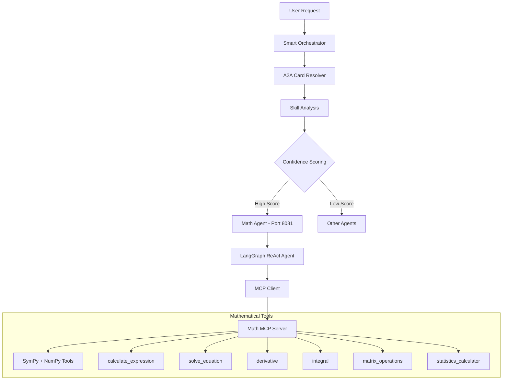

# Math Agent - Advanced Mathematical Computation System

Advanced mathematical assistant for calculations, equation solving, calculus, statistics, and matrix operations using **Google AI (Gemini 1.5 Flash)**, **MCP (Model Context Protocol)**, and **A2A SDK**. **The agent integrates seamlessly with the [intelligent orchestrator system](../orchestrator/README.md) for automatic routing**.

##  **Smart Orchestrator Integration**

The Math Agent integrates with the intelligent orchestrator for automatic routing:

### Direct Mathematical Operations
```
"What is 2+3?" → Math Agent (95% confidence)
"Solve x^2 - 4 = 0" → Math Agent (100% confidence)
"Find derivative of x^2 + 3x" → Math Agent (100% confidence)
```

### Skill-Based Routing
```
"solve mathematical equation" → Math Agent (84% confidence)  
"arithmetic calculation" → Math Agent (100% confidence)
"calculus operations" → Math Agent (100% confidence)
```

##  Architecture Overview

The Math Agent uses a sophisticated **MCP-based architecture** that separates mathematical computation from language understanding:



##  Features

###  Arithmetic Calculations
- **Basic Operations**: Addition, subtraction, multiplication, division
- **Advanced Functions**: Trigonometric, logarithmic, exponential
- **Mathematical Constants**: π, e, and other constants
- **Complex Numbers**: Support for complex arithmetic

###  Equation Solving
- **Linear Equations**: `2x + 5 = 11`
- **Quadratic Equations**: `x^2 - 4 = 0`
- **Polynomial Equations**: Any degree polynomial equations
- **Systems of Equations**: Multiple equation systems

###  Calculus Operations
- **Derivatives**: Find derivatives of mathematical functions
- **Integrals**: Calculate indefinite and definite integrals
- **Symbolic Mathematics**: Full symbolic computation support
- **Limits**: Calculate mathematical limits

###  Matrix Operations
- **Matrix Arithmetic**: Addition, subtraction, multiplication
- **Matrix Properties**: Inverse, transpose, determinant
- **Linear Algebra**: Eigenvalues, eigenvectors
- **Support for Any Size**: No matrix size limitations

###  Statistics Analysis
- **Descriptive Statistics**: Mean, median, mode, range
- **Variability Measures**: Standard deviation, variance
- **Data Analysis**: Comprehensive numerical dataset analysis
- **Probability Distributions**: Common statistical distributions

##  Supported Operations

### Mathematical Calculations
- **Basic Math**: "What is 2+3?", "Calculate 15 * 24"
- **Equation Solving**: "Solve x^2 - 4 = 0", "Find roots of 2x + 5 = 11"
- **Calculus**: "Derivative of x^2 + 3x", "Integrate e^x dx"
- **Matrix Operations**: "Determinant of [[1,2],[3,4]]"
- **Statistics**: "Mean of [1,2,3,4,5]", "Standard deviation of data"

### Advanced Mathematical Analysis
- **Complex Calculations**: "Solve systems of linear equations"
- **Mathematical Functions**: "Graph the function y = x^2 + 2x - 3"
- **Numerical Analysis**: "Find numerical solutions to differential equations"

##  Agent Card (A2A Integration)

### Orchestrator Recognition

The orchestrator recognizes this agent with the following capabilities:

```python
Math Agent Card:
- agent_id: "math"
- name: "Math Agent"
- description: "Advanced mathematical assistant for calculations..."
- endpoint: "http://localhost:8081"
- skills: [
    "arithmetic_calculation",  # Basic and advanced calculations
    "equation_solving",        # Algebraic equation resolution
    "calculus_operations",     # Derivatives and integrals
    "matrix_operations",       # Linear algebra computations
    "statistics_analysis"      # Data analysis and statistics
  ]
- keywords: ["calculate", "solve", "equation", "derivative", "integral", 
            "matrix", "statistics", "math"]
```

### Routing Examples

```bash
# High-confidence Math routing (90%+)
"What is 2+3?" → Math Agent (95%)
"Solve x^2 - 4 = 0" → Math Agent (100%)
"Find derivative of x^2 + 3x" → Math Agent (100%)
"Calculate determinant of [[1,2],[3,4]]" → Math Agent (100%)

# Skill-based routing
"solve mathematical equation" → Math Agent (84%)
"arithmetic calculation" → Math Agent (100%)
"calculus operations" → Math Agent (100%)
```

##  Quick Start

### Option 1: Via Orchestrator (Recommended)

Run as part of the intelligent orchestration system:

```bash
# Terminal 1: Start Math Agent
cd mathAgent
export GOOGLE_API_KEY=your_google_api_key
uv sync
uv run -m app

# Terminal 2: Start Orchestrator
cd ../orchestrator
export GOOGLE_API_KEY=your_google_api_key
uv run -m app

# Terminal 3: Test routing
cd ../orchestrator
export GOOGLE_API_KEY=your_google_api_key
# Direct math operations
uv run -m app -m "What is 2+3?" -v
uv run -m app -m "Solve x^2 - 4 = 0" -v

# Using client
cd ../orchestrator_client
export GOOGLE_API_KEY=your_google_api_key
uv run . --agent http://localhost:8000
# > "What is the derivative of x^2 + 3x?"
```

### Option 2: Direct Agent Connection

Connect directly to the math agent:

```bash
cd mathAgent

# Set up environment
echo "GOOGLE_API_KEY=your_google_api_key_here" > .env

# Install dependencies
uv sync

# Run the agent
uv run -m app

# Test directly
uv run -m app.test_client
```
##  Testing & Validation

### Comprehensive Test Suite

```bash
# Run agent-specific tests
cd mathAgent
uv run -m app.test_client

# Test orchestrator routing
cd ../orchestrator
uv run -m app -m "What is 2+3?" -v
uv run -m app -m "Solve x^2 - 4 = 0" -v

# Test direct agent communication
curl -X POST http://localhost:8081 \
  -H "Content-Type: application/json" \
  -d '{"method": "message/send", "params": {"message": {"parts": [{"text": "What is 2+3?"}]}}}'
```

### Expected Test Results

**Mathematical Operations**:
```
 Basic Arithmetic: "2 + 3 = 5"
 Equation Solving: "x^2 - 4 = 0 has solutions x = 2, x = -2"
 Calculus: "The derivative of x^2 + 3x is 2x + 3"
 Matrix Operations: "Determinant of [[1,2],[3,4]] = -2"
 Statistics: "Mean of [1,2,3,4,5] = 3.0"
```

##  Technical Architecture

### MCP Integration

The agent uses a custom MCP server for mathematical operations:

```python
# MCP Server with mathematical tools
from mcp import ClientSession, StdioServerParameters
from mcp.client.stdio import stdio_client
from langchain_mcp_adapters.tools import load_mcp_tools

class MathAgent:
    async def _create_agent_with_mcp_tools(self):
        server_params = StdioServerParameters(
            command="python",
            args=[str(math_server_path)],
        )
        
        async with stdio_client(server_params) as (read, write):
            async with ClientSession(read, write) as session:
                await session.initialize()
                tools = await load_mcp_tools(session)
                self.agent = create_react_agent(self.model, tools)
```

### A2A Protocol Implementation

```python
from a2a.server.agent_execution import AgentExecutor

class MathAgentExecutor(AgentExecutor):
    def __init__(self):
        self.agent = MathAgent()
    
    async def execute(self, context: RequestContext, event_queue: EventQueue):
        # Handle A2A protocol requests
        # Route to LangGraph + MCP agent
        # Return formatted responses
```

### Mathematical Tools (MCP Server)

The custom MCP server provides mathematical capabilities:

- **calculate_expression**: Evaluate mathematical expressions
- **solve_equation**: Solve algebraic equations  
- **derivative**: Calculate derivatives symbolically
- **integral**: Compute integrals
- **matrix_operations**: Linear algebra operations
- **statistics_calculator**: Statistical analysis

##  Development

### Project Structure
```
mathAgent/
├── app/
│   ├── __init__.py
│   ├── __main__.py           # A2A server entry point
│   ├── agent_executor.py     # A2A protocol executor
│   ├── agent.py              # Math agent logic
│   └── test_client.py        # Test client
├── math_mcp_server.py       # Custom MCP server
├── pyproject.toml           # Dependencies and metadata
└── README.md               # This file
```

### Dependencies
```toml
dependencies = [
    "a2a-sdk>=0.2.6,<0.3.0",           # A2A protocol support
    "langchain-google-genai>=2.0.4",   # Google AI integration
    "langgraph>=0.2.0",                # ReAct agent framework
    "langchain-mcp-adapters>=0.1.0",   # MCP integration
    "sympy>=1.12",                     # Symbolic mathematics
    "numpy>=1.24.0",                   # Numerical computations
]
```

### Environment Configuration
```bash
# Google AI (recommended)
export GOOGLE_API_KEY="your-google-api-key"

# OR OpenAI (if using OpenAI instead)
export API_KEY="your-openai-api-key"
export OPENAI_API_BASE="https://api.openai.com/v1"
```

##  Configuration Options

### LLM Provider Selection
```python
def _initialize_model(self):
    api_key = os.getenv("GOOGLE_API_KEY")
    if not api_key:
        print("  GOOGLE_API_KEY not set. Using default configuration.")
        self.model = ChatGoogleGenerativeAI(
            model="gemini-1.5-flash",
            temperature=0
        )
    else:
        self.model = ChatGoogleGenerativeAI(
            model="gemini-1.5-flash",
            google_api_key=api_key,
            temperature=0
        )
```

### MCP Server Configuration
```python
# Custom MCP server for mathematical operations
server_params = StdioServerParameters(
    command="python",
    args=[str(math_server_path)],
)

# Load mathematical tools
tools = await load_mcp_tools(session)
agent = create_react_agent(self.model, tools)
```

### Supported Mathematical Operations
```python
def get_capabilities(self) -> List[str]:
    return [
        "Arithmetic calculations and expression evaluation",
        "Algebraic equation solving", 
        "Calculus operations (derivatives and integrals)",
        "Matrix operations and linear algebra",
        "Statistical analysis and data processing",
        "Mathematical function plotting and visualization"
    ]
```
##  API Reference

### MathAgent Class
```python
class MathAgent:
    def __init__(self) -> None
    async def process_request(self, request: str) -> str
    def get_capabilities(self) -> List[str]
```

### Key Methods
- `process_request()`: Process mathematical queries using MCP tools
- `get_capabilities()`: List available mathematical capabilities
- `_create_agent_with_mcp_tools()`: Initialize agent with MCP mathematical tools

### Supported Mathematical Functions
```
Basic: +, -, *, /, %, ^, sqrt, abs, floor, ceil
Trigonometric: sin, cos, tan, asin, acos, atan, sinh, cosh, tanh
Logarithmic: ln, log, log10, log2, exp
Advanced: derivative, integral, solve, matrix operations, statistics
```

##  Mathematical Examples

### Arithmetic Operations
```bash
"What is (3 + 5) × 12?" → "96"
"Calculate 2^10" → "1024"
"What is the square root of 144?" → "12"
```

### Equation Solving
```bash
"Solve 2x + 5 = 15" → "x = 5"
"Find roots of x^2 - 4x + 3 = 0" → "x = 1, x = 3"
"Solve the system: x + y = 5, x - y = 1" → "x = 3, y = 2"
```

### Calculus Operations
```bash
"Derivative of x^2 + 3x + 2" → "2x + 3"  
"Integrate x^2 dx" → "x^3/3 + C"
"Find the limit of (x^2 - 1)/(x - 1) as x approaches 1" → "2"
```

### Statistics
```bash
"Mean of [1, 2, 3, 4, 5, 6, 7, 8, 9, 10]" → "5.5"
"Standard deviation of [2, 4, 4, 4, 5, 5, 7, 9]" → "2.0"
"Variance of the dataset [1, 3, 5, 7, 9]" → "10.0"
```

---

**Built with LangGraph, MCP Protocol, and SymPy**  