# 🤖 Smart Orchestrator - Intelligent Agent Routing System

An intelligent orchestrator agent built with **LangGraph** and **A2A Protocol** that automatically routes user requests to the best available specialized agent using dynamic capability discovery and skill-based matching.

## 🚀 **Key Features**

The orchestrator provides **intelligent single-agent routing** for optimal request handling:

### Dynamic Agent Discovery
```
Agent Registration → AgentCard Analysis → Skill Extraction → Capability Registry
```

### Intelligent Routing
```
"Convert 100 USD to EUR" → Currency Agent (100% confidence)
"What is 2+3?" → Math Agent (95% confidence)
"List applications" → ArgoCD Agent (100% confidence)
```

## 🏗️ Architecture

The orchestrator uses **A2A SDK integration** with intelligent routing:

```mermaid
graph TD
    A[User Request] --> B[🎯 Smart Orchestrator]
    B --> C[A2A Card Resolver]
    C --> D[Agent Discovery]
    D --> E[Skill Analysis]
    E --> F[Confidence Scoring]
    F --> G{Route Decision}
    
    G -->|High Confidence| H[Forward to Best Agent]
    G -->|Low Confidence| I[Fallback Response]
    
    H --> J[Agent Communication]
    J --> K[Response Processing]
    K --> L[Formatted Output]
    
    subgraph "A2A Integration"
        C
        D
        E
        F
    end
    
    subgraph "Agent Routing"
        G
        H
        J
        K
    end
```



### Core Components

1. **A2A Card Resolver**: Fetches agent capabilities from running endpoints
2. **Dynamic Skill Registry**: Extracts skills, tags, and keywords from AgentCards
3. **Confidence Scoring**: Quantifies routing decisions based on skill matching
4. **Agent Communication**: Handles HTTP communication with selected agents
5. **Response Processing**: Formats agent responses for users

## 🎯 Supported Agents

### ArgoCD Agent
- **Endpoint**: `http://localhost:8001`
- **Skills**: `kubernetes_management`, `gitops`, `application_deployment`, `argocd_operations`, `sync_operations`, `resource_monitoring`
- **Keywords**: `argocd`, `kubernetes`, `k8s`, `kubectl`, `deploy`, `application`, `sync`
- **Use Cases**: Kubernetes management, GitOps operations, application deployment

### Currency Agent
- **Endpoint**: `http://localhost:8002`
- **Skills**: `currency_exchange`, `financial_data`, `market_analysis`, `rate_conversion`, `historical_data`
- **Keywords**: `currency`, `exchange`, `rate`, `convert`, `dollar`, `eur`, `usd`, `inr`, `gbp`, `jpy`
- **Use Cases**: Currency conversion, exchange rates, financial data analysis

### Math Agent
- **Endpoint**: `http://localhost:8003`
- **Skills**: `arithmetic_calculation`, `equation_solving`, `calculus_operations`, `matrix_operations`, `statistics_analysis`
- **Keywords**: `calculate`, `solve`, `equation`, `derivative`, `integral`, `matrix`, `statistics`
- **Use Cases**: Mathematical calculations, equation solving, calculus, statistics, matrix operations

## 🚀 Quick Start

### Prerequisites
- Python 3.10+ (required for A2A SDK compatibility)
- [uv](https://docs.astral.sh/uv/) package manager

### Installation

```bash
# Clone and navigate to orchestrator
cd orchestrator

# Install dependencies
uv sync
```

### Basic Usage

```bash
# Test intelligent routing
uv run -m app -m "Convert 100 USD to EUR" -v
uv run -m app -m "What is 2+3?" -v
uv run -m app -m "List ArgoCD applications" -v

# Test agent management
uv run -m app -m "LIST_AGENTS"
uv run -m app -m "REGISTER_AGENT:http://localhost:8080"
```

## 🌐 FastAPI Agent Management Endpoints

The orchestrator now includes **FastAPI endpoints** for programmatic agent management, providing both REST API and interactive documentation.

### Starting the Server with API Endpoints

```bash
cd orchestrator
uv sync
uv run -m app --host localhost --port 8000
```

The server provides both:
- **A2A Protocol endpoints** at `http://localhost:8000/` (for agent-to-agent communication)
- **FastAPI Management endpoints** at `http://localhost:8000/management/` (for administration)

### API Documentation

📖 **Interactive API Docs**: `http://localhost:8000/management/docs`  
📋 **Alternative Docs**: `http://localhost:8000/management/redoc`

### Available Endpoints

#### 1. List Agents
```bash
# GET request
curl http://localhost:8000/management/api/v1/agents/list

# Alternative GET endpoint
curl http://localhost:8000/management/api/v1/agents/list_agents
```

**Response:**
```json
{
  "success": true,
  "agents": [
    {
      "agent_id": "Currency Agent",
      "name": "Currency Agent",
      "description": "Intelligent currency exchange and financial data agent",
      "endpoint": "http://localhost:8002",
      "skills": [
        {"name": "Currency Exchange", "description": "Convert between currencies"}
      ],
      "keywords": ["currency", "exchange", "rate"],
      "capabilities": ["pushNotifications"]
    }
  ],
  "total_count": 1,
  "message": "Found 1 registered agents"
}
```

#### 2. Register Agent
```bash
# POST request (recommended)
curl -X POST http://localhost:8000/management/api/v1/agents/register \
     -H 'Content-Type: application/json' \
     -d '{"endpoint": "http://localhost:8001"}'

# GET request (alternative)
curl 'http://localhost:8000/management/api/v1/agents/register_agent?endpoint=http://localhost:8001'
```

**Response:**
```json
{
  "success": true,
  "agent_id": "Math Agent",
  "agent_name": "Math Agent",
  "endpoint": "http://localhost:8001",
  "message": "Successfully registered Math Agent from http://localhost:8001"
}
```

#### 3. Unregister Agent
```bash
# POST request (recommended)
curl -X POST http://localhost:8000/management/api/v1/agents/unregister \
     -H 'Content-Type: application/json' \
     -d '{"agent_identifier": "Math Agent"}'

# GET request (alternative)  
curl 'http://localhost:8000/management/api/v1/agents/unregister_agent?agent_identifier=Math Agent'
```

**Response:**
```json
{
  "success": true,
  "agent_id": "Math Agent",
  "agent_name": "Math Agent", 
  "endpoint": "http://localhost:8001",
  "message": "Successfully unregistered Math Agent (ID: Math Agent)"
}
```

### Python Client Usage

Use the provided test client for programmatic access:

```python
from test_agent_management_api import AgentManagementClient

client = AgentManagementClient("http://localhost:8000")

# List agents
agents = await client.list_agents()
print(f"Found {agents['total_count']} agents")

# Register new agent
result = await client.register_agent("http://localhost:8004")
if result['success']:
    print(f"Registered: {result['agent_name']}")

# Unregister agent
result = await client.unregister_agent("Math Agent")
if result['success']:
    print(f"Unregistered: {result['agent_name']}")
```


### Testing the API

```bash
# Run the test client
python test_agent_management_api.py

# Run with help for examples
python test_agent_management_api.py --help
```

### API Features

- ✅ **RESTful Design**: Proper HTTP methods and status codes
- ✅ **Input Validation**: Pydantic models for request/response validation  
- ✅ **Error Handling**: Comprehensive error responses with details
- ✅ **Interactive Docs**: Swagger UI and ReDoc documentation
- ✅ **CORS Support**: Cross-origin requests enabled
- ✅ **Multiple Formats**: Both POST (JSON) and GET (query params) support
- ✅ **Async Operations**: Non-blocking agent registration/deregistration

## 🔧 Running the Full System

### Step 1: Start the Agents

**Terminal 1 - Currency Agent:**
```bash
cd currencyAgent
export GOOGLE_API_KEY=your_google_api_key
uv sync
uv run -m app
```

**Terminal 2 - Math Agent:**
```bash
cd mathAgent
export GOOGLE_API_KEY=your_google_api_key
uv sync
uv run -m app 
```

**Terminal 3 - ArgoCD Agent:**
```bash
cd argocdAgent
export GOOGLE_API_KEY=your_google_api_key
export ARGOCD_BASE_URL="https://your-argocd-server.com/"
export ARGOCD_API_TOKEN="your-argocd-api-token"
uv sync
uv run -m app
```

### Step 2: Test the Orchestrator

**Terminal 4 - Smart Orchestrator:**
```bash
cd orchestrator
uv sync
export GOOGLE_API_KEY=your_google_api_key

# Test intelligent routing
uv run -m app -m "What is the exchange rate for USD to EUR?" -v
uv run -m app -m "Solve x^2 - 4 = 0" -v
uv run -m app -m "List all applications in my cluster" -v

# Test agent discovery
uv run -m app -m "LIST_AGENTS"
```

## 🧪 Routing Examples

### High-Confidence Routing
```bash
# Currency Agent (100% confidence)
uv run -m app -m "What is 10 USD to INR?" -v
# Output: Routes directly to Currency Agent

# Math Agent (95% confidence)  
uv run -m app -m "What is 2+3?" -v
# Output: Routes directly to Math Agent

# ArgoCD Agent (100% confidence)
uv run -m app -m "Sync guestbook application" -v
# Output: Routes directly to ArgoCD Agent
```

### Skill-Based Matching
```bash
# Financial operations → Currency Agent
uv run -m app -m "financial market analysis" -v
# Output: Currency Agent (69% confidence)

# Mathematical operations → Math Agent
uv run -m app -m "solve mathematical equation" -v
# Output: Math Agent (84% confidence)

# Kubernetes operations → ArgoCD Agent
uv run -m app -m "kubernetes cluster management" -v
# Output: ArgoCD Agent (74% confidence)
```

## 🔍 How Agent Discovery Works

### A2A Integration
1. **Endpoint Discovery**: Connects to default agent endpoints (8080, 8081, 8082)
2. **AgentCard Fetching**: Uses A2A CardResolver to get agent metadata
3. **Skill Extraction**: Extracts skills, tags, descriptions, and names
4. **Capability Registry**: Builds searchable keyword registry

### Dynamic Registration
```python
# Register new agent
orchestrator.register_agent("http://localhost:8083")

# Unregister agent  
orchestrator.unregister_agent("agent_name")

# Get available agents
orchestrator.get_available_agents()
```

### Confidence Scoring Algorithm
```python
def calculate_agent_score(self, request: str, agent_card: AgentCard) -> float:
    # 1. Skill name matching (primary)
    # 2. Tag matching (secondary) 
    # 3. Description keyword matching (tertiary)
    # 4. Agent name matching (fallback)
    # Returns: confidence score (0.0 - 1.0)
```

## 🛠️ Technical Implementation

### A2A SDK Integration

The orchestrator uses A2A SDK for standardized agent communication:

```python
from a2a.client import A2AClient, A2ACardResolver
from a2a.types import AgentCard, AgentSkill

# Fetch agent card
resolver = A2ACardResolver(httpx_client=client, base_url=endpoint)
agent_card = await resolver.get_agent_card()

# Extract capabilities
for skill in agent_card.skills:
    self.skill_keywords[skill.name] = skill.tags + [skill.description]
```

### LangGraph Workflow

The orchestrator uses a simple LangGraph workflow:

```python
workflow = StateGraph(RouterState)
workflow.add_node("analyze", self._analyze_request)
workflow.add_node("route", self._route_to_agent)
workflow.set_entry_point("analyze")
workflow.add_edge("analyze", "route")
workflow.set_finish_point("route")
```

### Configuration

Environment variables and defaults:

```python
# Default agent endpoints
default_agents = [
    "http://localhost:8001",  # Configurable
    "http://localhost:8002",  # Configurable  
    "http://localhost:8003"   # Configurable
]

# HTTP client configuration
httpx.AsyncClient(timeout=5.0, verify=False)
```


## 🔧 Development

### Project Structure
```
orchestrator/
├── app/
│   ├── __init__.py
│   ├── __main__.py           # CLI entry point
│   ├── agent_executor.py     # A2A agent executor
│   └── orchestrator.py       # Smart orchestrator logic
├── pyproject.toml           # Dependencies and metadata
└── README.md               # This file
```

### Dependencies
```toml
dependencies = [
    "a2a-sdk>=0.2.6,<0.3.0",    # A2A protocol support
    "fastapi>=0.104.0",          # Web framework
    "uvicorn[standard]>=0.24.0", # ASGI server
    "httpx>=0.25.0",             # HTTP client
    "langgraph>=0.2.0",          # Workflow orchestration
    "langchain-core>=0.3.0",     # LangChain integration
]
```

### Running as A2A Agent
```bash
# Start as A2A agent server
uv run -m app

# Test agent endpoint
curl http://localhost:8000/agent-card
```


### Direct CLI Usage  
```bash
# Direct message processing
uv run -m app -m "Your message here" -v

# With debugging
uv run -m app -m "Convert USD to EUR" -v -d
```

## 🧪 Testing

### Unit Tests
```bash
# Run orchestrator tests
uv run pytest

# Test agent discovery
uv run -m app -m "LIST_AGENTS"

# Test routing logic
uv run -m app -m "Convert 100 USD to EUR" -v
```

### Integration Tests
```bash
# Test with running agents
cd ../currencyAgent && uv run -m app &
cd ../mathAgent && uv run -m app &
cd ../argocdAgent && uv run -m app &

# Test orchestrator routing
uv run -m app -m "What is 2+3?" -v
uv run -m app -m "Convert 100 USD to EUR" -v
```

## 📚 API Reference

### SmartOrchestrator Class

```python
class SmartOrchestrator:
    def __init__(self) -> None
    async def register_agent(self, endpoint: str) -> Dict
    async def unregister_agent(self, agent_identifier: str) -> Dict
    def get_available_agents(self) -> List[Dict]
    async def process_request(self, request: str) -> Dict
```

### Key Methods

- `register_agent()`: Register new agent by endpoint
- `unregister_agent()`: Remove agent by ID/name/endpoint
- `get_available_agents()`: List all registered agents
- `process_request()`: Route request to best agent

## 🔮 Future Enhancements

- **Load Balancing**: Route to multiple instances of same agent type
- **Health Monitoring**: Periodic agent health checks
- **Caching**: Response caching for repeated requests
- **Agent Marketplace**: Dynamic agent discovery from registry
- **Advanced Routing**: Machine learning-based routing optimization

---

**Built with A2A Protocol, LangGraph, and intelligent agent routing** 🚀 